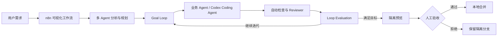

# Talent-AI

基于 n8n 源码扩展的多 Agent、Loop Engineering 与 Codex 自举开发平台原型。

Talent-AI 复用 n8n 的可视化画布、节点系统、凭据和执行记录，在此基础上增加多 Agent 协作、可验证循环，以及在隔离 Git worktree 中工作的 Codex Coding Agent。

> 当前项目面向 Windows 本地研究与演示，不是生产级多租户服务。

## 项目概览

| 能力 | 简介 |
| --- | --- |
| 多 Agent 工作流 | 在 n8n 画布上组合分析、规划、执行和评审 Agent |
| 预设 Agent 与 Skill | 管理可复用 Agent，并导入包含 `SKILL.md` 的 Skill 文件夹 |
| Loop Engineering | 通过 Goal Loop、Loop Evaluation 和 Round Timeline 形成可验证迭代 |
| Codex Coding Agent | 在隔离分支和 worktree 中修改代码，并执行固定验证流程 |
| Codex Runs | 查看 Coding Run、Turn、改动摘要和检查结果 |
| 自举开发 Demo | 完成需求规划、用户确认、编码、评审、隔离预览和本地合并 |

详细能力、实现机制、数据结构和验证记录见[《设计文档》](设计文档.md)。

## 架构



架构分为四部分：

- **n8n 平台层**：提供画布、节点协议、凭据、执行历史和工作流调度；
- **Agent 与循环层**：组织多个 Agent，并管理目标、轮次、评审和退出条件；
- **Codex Runtime**：连接本机 Codex CLI，在隔离 worktree 中完成代码修改；
- **验证与人工门禁**：运行固定检查、展示隔离实例，并由用户决定是否合并。

项目直接维护一份固定版本的 n8n 源码，而不是通过插件拼装全部能力。

## 仓库结构

```text
Talent-AI/
├─ upstream/n8n/                 n8n 源码及 Talent-AI 扩展
├─ workflows/
│  ├─ loop-engineering/         Loop Engineering 示例
│  └─ codex-coding/             Codex 自举开发示例
├─ scripts/                     构建、验证、预览和合并脚本
├─ 启动n8n.cmd                  Windows 完整功能启动器
├─ 关闭n8n.cmd                  停止本项目的 n8n 实例
├─ 设计文档.md                  架构、实现和验证说明
└─ 自定义节点字段说明.md        自定义节点使用手册
```

`upstream/n8n` 是仓库中的普通源码目录，不是 Git submodule。

## 快速开始

### 环境要求

- Windows 10/11；
- Git；
- Node.js 24.x；
- pnpm 11.22.0；
- 完整 Codex Demo 需要安装并登录 Codex CLI；
- 真实模型工作流需要自行配置模型 Provider 和 API 凭据。

当前源码基线为 `n8n@2.38.7`。仓库不包含 API Key、Codex 登录信息或本地 n8n 数据库。

### 1. 克隆项目

```powershell
git clone https://github.com/Xushuo174/Talent-AI.git
cd Talent-AI
```

### 2. 安装并构建

```powershell
cd upstream\n8n
pnpm.cmd install --frozen-lockfile
pnpm.cmd build --concurrency=1
```

首次完整构建耗时取决于机器配置。

### 3. 启动

回到项目根目录，双击：

```text
启动n8n.cmd
```

启动后访问 [http://localhost:5678](http://localhost:5678)。停止服务时双击 `关闭n8n.cmd`。

完整启动器要求 Codex CLI 已安装：

```powershell
npm install -g @openai/codex
codex login
```

如果 Codex CLI 不在默认的全局 npm 路径，请修改 `启动n8n.cmd` 中的 `CODEX_EXE`。

如果只需要基础 n8n、不使用 Codex Coding Agent，可在 `upstream/n8n` 中运行：

```powershell
pnpm.cmd start
```

## 运行 Demo

### Loop Engineering

导入 `workflows/loop-engineering/04-native-loop.json` 并从 Manual Trigger 运行，即可查看不依赖模型凭据的原生循环示例。

更多示例和操作步骤见 [Loop Engineering Demo 说明](workflows/loop-engineering/README.md)。

### Codex 自举开发

使用 `启动n8n.cmd` 启动完整环境，然后导入：

```text
workflows/codex-coding/06-codex-runs-sidebar-self-bootstrap.json
```

为 Planning Model 和 Review Model 选择自己的模型凭据后，即可演示需求规划、方案确认、Codex 编码、自动检查、隔离预览和人工合并。

完整操作见 [Codex Coding Agent Demo 说明](workflows/codex-coding/README.md)。

> 当前 Demo 会启用 Execute Command 节点运行仓库内的固定脚本，不要直接用于共享或公网 n8n 实例。

## 当前边界

- 面向 Windows 本地单机演示；
- 不包含生产级多租户隔离、远程 Worker 和崩溃恢复；
- 最终提升只执行本地合并，不会自动推送或创建 Pull Request；
- 自定义向量长期记忆和远程 Codex Runtime 尚未实现。

## 文档

- [设计文档](设计文档.md)：完整架构、设计取舍、实现机制和验证记录；
- [自定义节点字段说明](自定义节点字段说明.md)：Goal Loop、Loop Evaluation 和 Codex Coding Agent 字段；
- [Loop Engineering Demo](workflows/loop-engineering/README.md)：循环示例的导入与验证；
- [Codex Coding Agent Demo](workflows/codex-coding/README.md)：自举工作流的配置与运行。

## 许可

本仓库包含固定版本的 n8n 源码及其修改。使用、修改或分发前，请阅读：

- [n8n Sustainable Use License](upstream/n8n/LICENSE.md)
- [n8n Enterprise License](upstream/n8n/LICENSE_EE.md)

第三方组件继续遵循各自的原始许可证。
