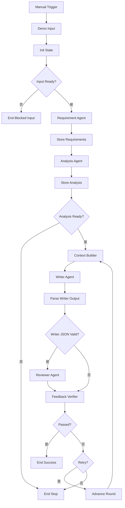

# Loop Engineering Demo 使用说明

## 本次交付与验证边界

本例验证“产物 → 独立评审与规则检查 → 反馈 → 修订”的外层循环。
输入为注册接口定义，输出为结构化测试用例，默认最多执行 3 轮。
这是设计文档中完整 Demo 的循环原型：Pre-Loop 暂时使用串行的 Requirement 和 Analysis，两个分析分支及 Merge 后续补充。

| 文件 | 用途 |
|---|---|
| `03A-control-check.json` | 固定样本控制测试。无需凭据，不调用模型。名为 Agent 的样本节点实际是 Code 节点。 |
| `03B-live-model.json` | 真实模型版。Requirement、Analysis、Writer、Reviewer 都是独立 AI Agent 节点。 |
| `03C-review-and-repair.json` | 审查明确有缺陷的用户初稿，再由真实模型修订。初稿为人工样本，修订效果需真实运行验证。 |
| `04-native-loop.json` | 原生 Loop Region 控制测试。Goal Loop 管理状态、上下文、裁决和退出，Loop Evaluation 规范评审协议。 |
| `logic.cjs` | 可复用的状态、上下文与验证函数，生成时嵌入 Code 节点。 |
| `fixtures.cjs` | 人工编写的固定测试样本，不是模型执行结果。 |

2026-09-15 本地检查结果：

- 导出的 Code 脚本、状态交接和所有控制路径通过本地检查。
- 固定版本 n8n `a2d0f7638bbb7582e33a4dfa1537eeb8ff066788` 的真实 WorkflowExecute 调度器和原生 IF、Manual Trigger 节点，通过五种固定样本场景。
- 调度器检查中的 Code 节点使用本地 VM 适配器。尚未验证浏览器导入及原生 Code task runner，也没有执行真实 DeepSeek 请求。
- 尚无模型跨轮改善的实测结果。请按以下步骤完成实例验收。

## 零、验证原生 Loop Region

`04-native-loop.json` 面向已包含 Talent-AI 源码改动的 n8n 2.38.7（本地基线 `fa34d4cd`）。导入后从 Manual Trigger 完整运行，预期：

1. `Pre-Loop Input` 只执行一次；
2. Goal Loop 第一轮从 `iterate` 输出；
3. `Writer and Test Fixture` 第一轮产生缺少 `expectedResult` 和 21 位密码边界的固定缺陷样本；
4. Loop Evaluation 把确定性检查与 Reviewer 结果规范为 `LoopEvaluationV1`；
5. Goal Loop 生成第二轮 `LoopContextV1`，其中只包含稳定目标、当前产物、失败证据、Reviewer 建议、历史摘要和下一步重点；
6. 第二轮通过，从 `completed` 到达 `Completed`；
7. Loop Region 标题栏显示 `Round 2 / 3 · Passed`，点击徽标可以查看 Round Timeline。

固定 Code 节点只充当可重复的 Writer 与测试夹具。它不保存轮次、不决定继续或停止，也不构造下一轮上下文，因此 04 验证的是平台原生控制语义。要替换为真实场景，只需把该节点换成业务 Agent、工具、确定性测试和 Reviewer，并保持 Loop Evaluation 的字段协议。

2026-09-17 本地源码验证已通过：04 在真实 `WorkflowExecute` 调度器中第二轮完成，Pre-Loop 只执行一次，失败证据进入第二轮上下文，且每轮状态已写入 execution metadata，供 Round Timeline 读取。该结果不包含浏览器导入和真实模型调用。

也可以选中已有的单入口、单出口业务子图，点击选择工具栏中的 **Create Loop Region**。平台会插入 Goal Loop 和 Loop Evaluation、建立反馈边，并把原外部出口接到 `completed`。多分支必须先 Merge；非法选择会显示具体提示。

## 一、先导入固定样本版

1. 在 n8n 新建工作流。
2. 在工作流菜单中找到 Import from File，选择 `03A-control-check.json`。
3. 保存工作流。从 Manual Trigger 完整运行，点击 Execute workflow。
4. 默认场景应到达 End Success，最终 State 为 `status=success`、`round=2`。

如果当前界面支持从剪贴板粘贴节点，也可以复制整个 JSON 后粘贴到空画布。
请保持节点名称不变：状态恢复表达式引用了这些名称。
不要把测试样本固定到真实模型版中，也不要把固定样本执行记录称为模型验证。

### 五个测试场景

打开 Demo Input Code 节点，修改第一段的 `testMode` 字符串，再完整运行：

| testMode | 实际输入/产物变化 | 预期结果 |
|---|---|---|
| `retry_then_pass` | 第 1 轮样本缺少 B21，第 2 轮样本补齐 | success，round=2 |
| `pass_first` | 样本一开始就是完整的 | success，round=1 |
| `always_fail` | 每轮样本都缺少 B21 | failed，round=3，exitReason=maxRounds |
| `invalid_json` | Writer 样本返回不能解析的文本 | blocked，round=1 |
| `missing_input` | 输入没有接口定义 | blocked，进入 End Blocked Input，不调用 Agent |

`maxRounds=1` 加 `always_fail` 应在第 1 轮停止。round 表示已经执行的当前轮，只有 Advance Round 才递增。
固定样本 Reviewer 故意总是返回 pass，以验证确定性规则能够独立否决“通过”建议。

## 二、导入真实模型版

1. 新建另一条工作流，导入 `03B-live-model.json`。
2. 打开 DeepSeek Chat Model，选择你已有的 DeepSeek 凭据。文件不包含 API Key 或凭据引用。
3. 模型预填 `deepseek-flash`，可以改为你已验证可用的模型。
4. 确保 n8n 启动进程仍使用已经验证的网络代理配置。
5. 从 Manual Trigger 完整运行。不要只执行循环中间的单个节点。

四个 Agent 共享一个模型配置节点，但各自拥有独立 System Message 和输入。这里没有配置跨轮 Memory；外层上下文由 State 显式传递。
每次完整运行会发起需求、分析、生成与评审的模型请求；重试时只重新调用 Writer 和 Reviewer。
真实模型版不使用 `testMode` 控制模型结果。它可能首轮直接通过，这也是合法执行结果。

## 三、画布结构

### 03B 首轮通过时，改用 03C 展示初稿修订

本机执行记录 #44 显示 03B 首轮生成 12 条用例，Verifier 返回 pass、issues=[]，所以 Context Builder 只执行一次。这是正常的首轮通过，不是回路失效。这次记录不能证明模型跨轮修复。

03C 提供一个明确标注的人工初稿作为 `Demo Input.initialDraft`，缺少 21 位密码边界。没有修改或伪装模型输出。

导入 03C，选择 DeepSeek 凭据后完整执行。先走 `Load User Draft → Review User Draft → Verify User Draft`，第 0 轮审查会识别缺失项，再经 Advance Round 进入原来的 Context Builder / Writer / Reviewer 循环。

- round=0：已有初稿的审查，不算一次 Writer 执行。
- round=1～3：真实 Writer 的修订尝试，最多 3 次。
- 一次修订成功时，Context Builder 仍然只执行一次；证据是 historySummary 的第 0 轮 fail 和第 1 轮 pass，以及方案的实际差异。
- 未通过时，仍会回到 Context Builder 做下一次修订。
- 输入是人工构造缺陷样本，因此只能声称“模型修复了给定的缺陷初稿”，不能声称模型自然产生缺陷后自动修复。

03C 的控制路径另经固定版本 n8n 调度器检查（模型使用固定替身、Code 使用 VM 适配器），真实修订输出仍需导入后验证。



IF 只有两个出口，因此用 Passed? 和 Retry? 两个节点表达三种动作。
重试回到 Context Builder，不返回 Init State 或 Requirement Agent。
所有节点始终只传递一个 State Item。循环中的状态恢复使用 `.all(0, $runIndex)`，读取同一次完整执行中对应轮次的数据。

## 四、每个关键节点做什么

### Demo Input / Init State

固定接口为 `POST /register`：

- R1：email 必须符合邮箱格式。
- R2：password 长度为 8～20 个字符。
- R3：已经注册的 email 不允许重复注册。

Init State 设置 round=1、maxRounds=3、原始目标、验收标准和空历史。
本例的规则验证器针对这三个规则编写。切换到其他接口时，需要同步修改验收标准、验证器和提示词，不能只改接口标题。

### Context Builder

首轮：目标 + 接口 + 验收标准 + 稳定需求分析。

重试：上述信息 + 上一轮完整 currentResult + feedback.issues + historySummary。

输出 `context.taskPrompt`、`context.mustKeep`、`context.mustFix`。Writer 的 Prompt 引用 `{{ $json.context.taskPrompt }}`。

### Writer / Parse Writer Output

Writer 生成完整的 `{ "cases": [...] }`，不只生成修改片段。
Parse Writer Output 把模型的 output 字符串解析成 currentResult，并恢复本轮 State。
JSON 语法无效时走 blocked；JSON 可解析但缺少 cases 等内容时走可修复的 fail。

每条用例结构如下：

```json
{
  "id": "TC01",
  "title": "密码最小合法长度",
  "category": "boundary",
  "ruleIds": ["R2"],
  "preconditions": "该邮箱尚未注册。",
  "emailAlreadyRegistered": false,
  "request": { "email": "new@example.com", "password": "abcdefgh" },
  "steps": ["提交注册请求。", "检查注册结果。"],
  "expectedResult": { "outcome": "accepted", "description": "注册被接受。" }
}
```

### Reviewer / Feedback Verifier

Reviewer 评审语义，输出 `verdict` 和结构化 `issues`。只接收原始接口、验收标准、当前方案。

Code 验证器检查：

- cases 至少 6 条，ID 唯一，必填字段和类型正确。
- R1/R2/R3 都有映射，四类测试场景都存在。
- 密码实际长度为 7、8、20、21 的边界用例确实存在，且该用例邮箱合法、未注册，接受/拒绝预期正确。
- Reviewer 输出结构合法且无问题，才可能通过。

规则编号、分类存在，只能证明结构映射存在。完整业务语义仍依赖 Reviewer，不能把该 Demo 称为业务正确性的形式化证明。

结构化反馈示例：

```json
{
  "result": "fail",
  "passed": false,
  "blocked": false,
  "issues": [{
    "id": "PASSWORD_BOUNDARY_21",
    "message": "增加或修复密码实际长度 21 的边界用例：邮箱合法且未注册，预期 rejected。"
  }],
  "nextAction": "retry"
}
```

### Passed? / Retry? / Advance Round

| 条件 | 最终动作 |
|---|---|
| State.status == success | End Success |
| 未通过，且 nextAction == retry | round + 1，再进入 Context Builder |
| blocked 或达到 maxRounds | End Stop |

不要把原生 Retry On Fail 当成外层 Loop。它只是重试节点调用，不会自动构造本例的修订上下文。

## 五、怎样确认 Loop Engineering 有效

1. 查看第 1 轮 Feedback Verifier 的问题，例如 PASSWORD_BOUNDARY_21。
2. 在 Context Builder 的运行记录中切换到第 2 次执行，确认 mustFix 中存在该问题。
3. 确认第 2 轮 Prompt 同时包含原始接口、验收标准、上一轮完整方案。
4. 对比 Writer 两轮的用例，确认对应缺陷得到修复。
5. 确认 Requirement 和 Analysis 只运行一次。
6. 查看最终 historySummary：每一轮的状态、问题、用例数量都能追踪。
7. 即使 End Stop 显示绿色节点，也要看输出中的 status。n8n 的执行成功只说明控制流正常结束，不代表业务验收通过。

真实模型首轮通过时，请如实记录。若要进一步观察修订，可以在完整运行之后收集一次真实失败记录；不能偷偷删除模型产物或修改通过条件制造提升。
已有缺陷方案的修订也可以作为后续场景，但必须明确它是用户输入的初稿。

## 六、常见问题

- Prompt 放错位置：Source for Prompt 必须固定选 Define below；表达式填写在下方 Prompt 字段。本文件已配置好。
- 模型请求失败或输出非 JSON：查看 Agent 的执行详情。本例配置错误继续输出，以便规范为 blocked；基础设施使整个执行中止的错误仍需查看 n8n 错误记录。
- 引用某轮节点数据失败：确认从头运行，所有路径只传一个 Item，未重命名节点、未 pin 中间产物。
- Code 节点本身不能运行：检查启动终端中的 task runner 错误。这不属于模型失败，需要先解决 Code 运行环境。

## 七、重新生成和检查

从 Talent-AI 项目根目录运行：

```powershell
node scripts/build-loop-demo.cjs
node scripts/check-loop-demo.cjs
node scripts/check-loop-engine.cjs
node scripts/build-native-loop-demo.cjs
node scripts/check-native-loop-engine.cjs
```

前三条重新生成并检查 03A/03B/03C 对照工作流。第四条重新生成 04，且不会修改 n8n 数据库中的工作流。第五条通过已构建的上游源码和真实 `WorkflowExecute` 调度器验证 04 的两轮执行、Pre-Loop 次数、反馈上下文和 Round Timeline 元数据。
