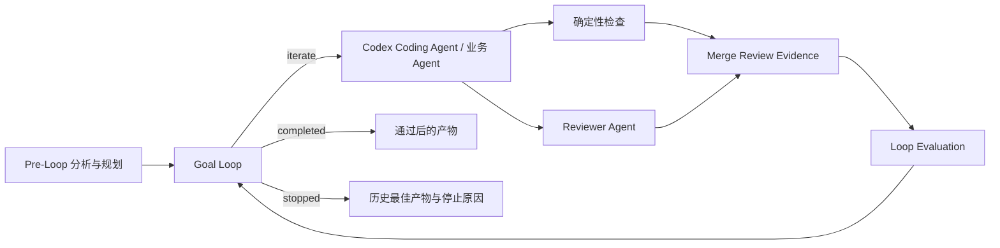

# Talent-AI 自定义节点字段说明

> 版本：v1.0<br>
> 日期：2026-09-18<br>
> 适用实现：Talent-AI `f45702f5` / n8n `2.38.7`

本文说明 Talent-AI 当前三个自定义工作流节点：

1. **Goal Loop**：维护目标、轮次、历史最佳结果和停止条件；
2. **Loop Evaluation**：把测试结果和 Reviewer 结果整理成统一评审协议；
3. **Codex Coding Agent**：在隔离 Git worktree 中调用 Codex 修改代码并执行固定验证。

文末补充 Loop Region 的连接规则和推荐配置。

---

## 1. 三个节点如何配合



三个节点的职责不能混淆：

| 节点 | 负责什么 | 不负责什么 |
| --- | --- | --- |
| Goal Loop | 保存目标与状态，决定继续、完成或停止 | 不写代码，不运行测试 |
| Loop Evaluation | 校验并统一评审数据格式 | 不调用模型，不决定是否继续 |
| Codex Coding Agent | 修改隔离 worktree，运行 Verification Profile | 不直接修改主目录，不自动合并 |

---

## 2. Goal Loop

### 2.1 节点作用

Goal Loop 是循环控制器。第一次收到 Pre-Loop 输入时，它创建循环状态并从 `iterate` 输出第一轮上下文；之后收到 Loop Evaluation 的反馈时，它判断：

- 是否已经通过；
- 是否需要下一轮；
- 是否被阻塞；
- 是否长期没有改善；
- 是否已经达到最大轮数。

Goal Loop 要求每次输入 **恰好一个 Item**。

---

### 2.2 Goal

#### 字段含义

整个循环保持不变的最终目标。

例如：

```text
为 Codex Runs 页面增加刷新按钮和最近刷新时间，并保证现有数据加载逻辑不被破坏。
```

#### 使用原则

- 必填；
- 描述最终结果，不写具体执行步骤；
- 循环中的每一轮都使用同一个 Goal；
- 不要把测试日志、临时错误或本轮修改建议塞进 Goal。

#### Goal 与 Task 的区别

| 字段 | 含义 |
| --- | --- |
| Goal | 多轮保持稳定的最终结果 |
| Codex Task | 本轮交给 Codex 的具体编码工作 |
| nextFocus | Goal Loop 根据失败证据生成的下一轮重点 |

---

### 2.3 Constraints

#### 字段含义

任务执行期间始终不能违反的边界，每行一条。

例如：

```text
不修改数据库结构和后端 API
只修改现有 Codex Runs 前端页面和文案
不得删除已有权限检查
```

Goal Loop 会按换行拆分并去除空行，最终保存为字符串数组。

#### 使用原则

- 可以为空，但真实开发任务建议填写；
- 只写稳定边界；
- 不要把实现步骤全部写成约束；
- 约束过多会让 Agent 很难找到可行方案。

---

### 2.4 Acceptance Criteria

#### 字段含义

判断 Goal 是否完成的验收标准，每行一条。

例如：

```text
页面存在手动刷新按钮
刷新请求期间按钮显示加载状态
页面显示最近一次成功刷新的时间
```

#### 使用原则

- 必填，至少一条；
- 应该可以通过测试、Reviewer 或人工操作判断；
- 描述可观察结果；
- 不要只写“代码质量良好”这类无法客观判断的标准。

Acceptance Criteria 本身不会自动执行。它们会进入 `loopContext`，由业务 Agent、测试节点和 Reviewer 用来产生具体评审结果。

---

### 2.5 Maximum Rounds

#### 默认值和范围

```text
默认：3
最小：1
最大：100
```

#### 字段含义

本次 Workflow Execution 最多允许执行多少轮循环体。

例如设置为 3：

```text
Round 1：首次实现
Round 2：根据测试和评审反馈修复
Round 3：最后一次修复机会
```

第三轮仍未通过时，Goal Loop 从 `stopped` 输出，并设置：

```text
stopReason = max_rounds
```

#### 注意

- 最后一轮仍然可以正常通过；
- Maximum Rounds 限制总轮数；
- Stop After Stagnant Rounds 限制连续无改善轮数；
- 两者不是同一个参数。

06 自举 Demo 为了缩短现场时间，当前设置为 `1`。因此 06 主要展示完整交付链路，多轮循环由 04 Native Loop Demo 证明。

---

### 2.6 Reviewer Pass Score

#### 默认值和范围

```text
默认：80
范围：0～100
```

#### 字段含义

当输入包含 Reviewer 结果时，Reviewer 分数至少达到多少才能通过。

通过必须同时满足：

1. 所有 `required: true` 的检查均通过；
2. Reviewer 的 `verdict` 必须是 `pass`；
3. Reviewer 的 `score` 必须大于或等于此阈值。

例如阈值为 80：

| Reviewer 结果 | 是否通过 |
| --- | --- |
| verdict=pass，score=85 | 可以通过，前提是必选检查也通过 |
| verdict=pass，score=75 | 不通过 |
| verdict=revise，score=90 | 不通过 |
| verdict=blocked，score=90 | 立即停止 |

如果评审数据中没有 Reviewer，只要所有必选检查通过，Goal Loop 也可以完成。

---

### 2.7 Stop After Stagnant Rounds

#### 默认值和范围

```text
默认：2
最小：1
最大：20
```

#### 字段含义

允许连续出现多少轮“没有明显改善”，达到后停止循环，避免 Agent 一直重复同样的错误。

当前源码把一轮判定为 stagnant，需要同时满足：

1. 不是第一轮；
2. 本轮失败的必选检查 ID 与上一轮相同；
3. 失败的必选检查数量没有减少；
4. Reviewer 分数提升小于 1 分。

例如：

| 轮次 | 失败检查 | Reviewer 分数 | 结果 |
| --- | --- | ---: | --- |
| Round 1 | typecheck、ui-test | 60 | 建立基线，不算停滞 |
| Round 2 | typecheck、ui-test | 60.5 | 第 1 个停滞轮次 |
| Round 3 | typecheck、ui-test | 60.8 | 第 2 个停滞轮次，停止 |

此时输出：

```text
stopReason = stagnated
```

#### 它不表示什么

- 不是“总共执行两轮”；
- 不是“两轮失败就一定停止”；
- 如果失败检查减少，停滞计数会清零；
- 如果 Reviewer 分数提升至少 1 分，停滞计数也会清零。

#### 配置建议

| 场景 | 建议值 |
| --- | ---: |
| 快速现场 Demo | 1 |
| 普通开发任务 | 2 |
| 允许逐步探索的复杂任务 | 3～4 |

如果 `Maximum Rounds=1`，这个参数实际上没有机会发挥作用。

---

### 2.8 History Window

#### 默认值和范围

```text
默认：3
最小：1
最大：20
```

#### 字段含义

下一轮 `loopContext.recentHistory` 中最多包含最近多少轮摘要。

每轮摘要包括：

- round；
- Reviewer score；
- 失败的必选检查 ID；
- Reviewer verdict；
- 本轮摘要。

例如设置为 3，在 Round 6 时只向下一轮提供 Round 3～5 的摘要，而不会回灌全部历史日志。

#### 注意

- 它只控制传给下一轮的近期摘要数量；
- 不影响 Goal Loop 内部保存完整轮次状态；
- 不控制 Codex thread 自身的历史长度；
- 值太大会增加上下文，值太小可能丢失近期变化趋势。

---

### 2.9 Additional Context

#### 字段含义

向每轮 `loopContext` 追加业务领域信息。

例如：

```js
{{ JSON.stringify({
  approvedDesign: $json.approvedSpecification.designSummary,
  reviewerInstructions: $json.approvedSpecification.reviewerInstructions
}) }}
```

#### 适合放什么

- 用户批准的设计摘要；
- 业务术语；
- 数据结构说明；
- Reviewer 特别关注项；
- 本任务相关但不属于 Goal 的稳定背景。

#### 不适合放什么

- 用它覆盖 Goal；
- 用它删除 Acceptance Criteria；
- 塞入完整执行日志；
- 塞入全部历史聊天；
- 重复存储大段 diff。

平台始终保留 Goal、Acceptance Criteria 和失败证据，Additional Context 只能追加信息。

---

### 2.10 三个输出

#### iterate

表示需要执行循环体。

第一轮输出会保留 Pre-Loop 输入，并增加：

```json
{
  "loopState": {},
  "loopContext": {
    "goal": "...",
    "constraints": [],
    "acceptanceCriteria": [],
    "round": 1,
    "maxRounds": 3,
    "latestFailures": [],
    "recentHistory": [],
    "nextFocus": []
  }
}
```

后续轮次的 iterate 输出包含更新后的 `loopState` 和 `loopContext`。

#### completed

表示：

- 所有必选检查通过；
- Reviewer 缺失，或者 Reviewer verdict=pass 且分数达到阈值。

输出包含：

- `loopState`；
- `loopEvaluation`；
- `artifact`：历史最佳产物；
- `stopReason: passed`。

#### stopped

表示：

- Reviewer 返回 blocked；
- 连续无改善；
- 达到最大轮数。

可能的 `stopReason`：

| 值 | 含义 |
| --- | --- |
| `blocked` | Reviewer 或运行状态表示无法继续 |
| `stagnated` | 连续多轮没有改善 |
| `max_rounds` | 达到最大轮数仍未通过 |

stopped 也会返回历史最佳 artifact，而不只是最后一轮结果。

---

### 2.11 历史最佳结果如何选择

Goal Loop 按以下顺序比较每轮产物：

1. 必选检查失败数量更少；
2. 失败数量相同时，Reviewer 分数更高；
3. 两者都相同时，选择更新的一轮。

因此达到最大轮数后，返回的不一定是最后一轮，而是历史表现最好的产物。

---

## 3. Loop Evaluation

### 3.1 节点作用

Loop Evaluation 是评审协议适配器：

```text
上游测试结果 + Reviewer 结果
            ↓
字段读取、格式检查、默认值补全
            ↓
LoopEvaluationV1
            ↓
Goal Loop
```

它不调用模型、不运行测试，也不决定是否继续。最终裁决由 Goal Loop 完成。

Loop Evaluation 要求输入 **恰好一个 Item**，所以多条测试和 Reviewer 分支必须先汇合。

---

### 3.2 Artifact Field

#### 默认值

```text
artifact
```

#### 字段含义

指定从输入 JSON 的哪个路径读取当前正在改进的产物。

Codex 场景中的 artifact 通常包含：

```json
{
  "runId": "...",
  "branchName": "...",
  "baseCommit": "...",
  "worktreePath": "...",
  "changedFiles": [],
  "diffStat": "...",
  "diffPreview": "...",
  "summary": "..."
}
```

其他工作流也可以把测试方案、文章或接口定义作为 artifact。

---

### 3.3 Checks Field

#### 默认值

```text
checks
```

#### 字段含义

指定从输入 JSON 的哪个路径读取检查数组。

```json
[
  {
    "id": "typecheck",
    "kind": "deterministic",
    "required": true,
    "passed": false,
    "message": "TypeScript typecheck failed",
    "evidence": {
      "file": "CodexRunsView.vue"
    }
  }
]
```

每个检查项：

| 字段 | 必填 | 默认值 | 含义 |
| --- | --- | --- | --- |
| `id` | 是 | 无 | 检查项唯一标识 |
| `kind` | 否 | deterministic | deterministic 或 reviewer |
| `required` | 否 | true | 是否必须通过 |
| `passed` | 是 | 无 | 检查是否通过 |
| `score` | 否 | 无 | 0～100 |
| `message` | 否 | 无 | 可读说明 |
| `evidence` | 否 | 无 | JSON 兼容的证据 |

---

### 3.4 Reviewer Field

#### 默认值

```text
reviewer
```

#### 字段含义

指定从输入 JSON 的哪个路径读取 Reviewer 结果。Reviewer 可以缺失，但存在时必须满足：

```json
{
  "score": 85,
  "verdict": "pass",
  "summary": "实现符合需求",
  "issues": [
    {
      "id": "issue-id",
      "severity": "warning",
      "message": "可改进问题",
      "suggestion": "修改建议"
    }
  ]
}
```

规则：

- score 必须在 0～100；
- verdict 只能是 `pass`、`revise`、`blocked`；
- summary 必须是非空字符串；
- issues 必须是数组；
- issue severity 只能是 `error` 或 `warning`，默认 error。

---

### 3.5 Extra Context Field

#### 默认值

```text
extraContext
```

#### 字段含义

读取要带入下一轮的附加业务信息，例如：

```json
{
  "codexRunId": "...",
  "threadId": "...",
  "turnId": "...",
  "approvedSpecification": {}
}
```

Extra Context 不直接参与通过或失败判断。

---

### 3.6 四个参数是不是固定的

四个默认值是字段路径，不是固定评审内容。

如果上游结构是：

```json
{
  "result": {
    "candidate": {},
    "testResults": [],
    "reviewResult": {},
    "domainContext": {}
  }
}
```

可以配置：

```text
Artifact Field      = result.candidate
Checks Field        = result.testResults
Reviewer Field      = result.reviewResult
Extra Context Field = result.domainContext
```

当前节点支持点路径读取。上游已经使用标准字段时，保留默认值即可。

---

### 3.7 输入与输出

#### 输入

```json
{
  "artifact": {},
  "checks": [],
  "reviewer": {},
  "extraContext": {}
}
```

#### 输出

节点保留原输入，并增加标准化后的：

```json
{
  "artifact": {},
  "checks": [],
  "reviewer": {},
  "extraContext": {},
  "loopEvaluation": {
    "version": 1,
    "artifact": {},
    "checks": [],
    "reviewer": {},
    "extraContext": {}
  }
}
```

Goal Loop 的反馈输入读取的是 `loopEvaluation`。

---

### 3.8 常见错误

| 错误 | 原因 |
| --- | --- |
| requires exactly one input item | 多条分支没有先 Merge，或没有输入 |
| evaluation.checks must be an array | Checks Field 指向的不是数组 |
| reviewer.score is required | 传入了 reviewer，但没有 score |
| reviewer.verdict must be pass, revise, or blocked | verdict 使用了其他字符串 |
| artifact must contain JSON-compatible data | artifact 中存在不可序列化值 |

---

## 4. Codex Coding Agent

### 4.1 节点作用

Codex Coding Agent 接收编码任务，在服务端白名单仓库的隔离 Git worktree 中运行 Codex，并由 n8n 宿主执行固定 Verification Profile。

节点要求输入 **恰好一个 Item**。

---

### 4.2 Repository

#### 字段含义

选择允许 Codex 修改的仓库。列表来自 n8n 服务端白名单，不允许在工作流中任意填写绝对路径。

当前配置：

```text
repositoryId = talent-ai
label        = Talent-AI
path         = E:\CodexProject\Talent-AI
```

#### 为什么使用 repositoryId

- 工作流 JSON 不暴露可修改的任意本机路径；
- 管理员可以集中控制允许的仓库；
- Verification Profile 可以绑定到指定仓库；
- 防止表达式路径穿越。

---

### 4.3 Task

#### 字段含义

本次 Codex turn 要完成的具体实现任务。

节点默认表达式：

```js
{{ JSON.stringify($json.loopContext ?? $json) }}
```

在自举 Demo 中，Task 来自用户已批准的方案：

```js
{{ $('Finalize Approved Goal Plan').item.json.approvedSpecification.implementationTask }}
```

#### 推荐写法

Task 应包含：

- 修改目标；
- 允许修改的范围；
- 明确不允许修改的范围；
- 需要复用的现有组件；
- 预期的最小验证。

Task 不应该包含任意 Shell 命令或要求关闭沙箱，因为这些权限不由工作流控制。

---

### 4.4 Goal

#### 字段含义

创建 Codex thread 时设置的稳定目标。默认从以下位置读取：

```js
{{ $json.loopContext?.goal ?? "" }}
```

#### 当前 06 Demo 的处理

06 Demo 中该字段有意留空，Goal 由 Goal Loop 维护，Codex 接收已经批准的具体 Task。

这样做是为了避免依赖 Codex App Server 独立 goals 功能及其本地数据库特性。Goal 字段留空不代表工作流没有目标。

---

### 4.5 Verification Profile

#### 字段含义

选择一组由服务端管理员预先配置的确定性命令，用来检查 Codex 修改后的 worktree。

它不是：

- Codex 自己生成的测试方案；
- Reviewer Agent；
- 一段可以由工作流填写的 Shell；
- 对模型输出的主观评分。

它是类似 CI 的固定质量检查。

#### 执行位置

流程为：

```text
Codex 修改 worktree
        ↓
n8n 宿主读取 Verification Profile
        ↓
按 file + args 执行固定命令
        ↓
生成 checks[]
        ↓
进入 Loop Evaluation
```

#### 当前三个 Profile

#### codex-node-targeted

适合修改 Codex Coding Agent 节点本身：

1. 执行 CodexCodingAgent 目标测试；
2. 执行 `n8n-nodes-base` 类型检查。

#### codex-runs-sidebar-targeted

适合修改 Codex Runs 页面及相关后端：

1. CLI 单元测试；
2. SQLite 集成测试；
3. CLI 类型检查；
4. Editor UI 目标测试；
5. Editor UI 类型检查。

该 Profile 较完整，但运行时间较长。

#### codex-demo-fast

执行：

```text
git diff --check
```

它只检查 diff 中明显的空白和补丁格式问题，适合时间紧张的 Demo，不等于完整编译和测试。

#### 与 Reviewer Agent 的关系

| Verification Profile | Reviewer Agent |
| --- | --- |
| 确定性命令 | 模型语义判断 |
| 检查构建、类型、测试、diff | 检查需求、设计、交互和范围 |
| 同一输入重复执行结果相对稳定 | 可能存在模型判断误差 |
| 由宿主执行 | 由模型执行 |

正式流程通常同时需要两者，最终还可以增加人工预览。

---

### 4.6 Model

#### 字段含义

指定 Codex 使用的模型。

- 留空：使用当前 Codex 默认模型；
- 填写：请求指定模型，例如当前 Demo 使用 `gpt-5.6-sol`。

指定模型必须被当前 Codex CLI 版本和账号支持。模型要求更高版本时，节点会返回 `runtime_failed`。

---

### 4.7 Reasoning Effort

可选值：

| 界面值 | 请求值 | 适用场景 |
| --- | --- | --- |
| Low | low | 小范围、路径明确、现场 Demo |
| Medium | medium | 普通代码修改 |
| High | high | 默认值，复杂实现 |
| Extra High | xhigh | 大范围分析或复杂问题 |

推理等级越高通常耗时越长。它不会改变 worktree 和权限边界。

06 Demo 当前使用 Low，以减少等待时间。

---

### 4.8 Timeout (Minutes)

#### 默认值和范围

```text
默认：20 分钟
界面范围：1～120 分钟
```

#### 字段含义

限制本次 Codex turn 的最长运行时间。

服务端可以配置更低的最大值，因此节点填写 60 分钟，不代表一定能运行 60 分钟。

超时后：

```text
status = timed_out
```

并会转换成 blocked 类型的 Loop Evaluation，避免工作流无限等待。

06 Demo 当前使用 8 分钟。

---

### 4.9 loopContext 的自动传递

如果输入包含合法的：

```text
$json.loopContext
```

Codex Coding Agent 会自动把它加入请求。

其中可以包含：

- Goal；
- Constraints；
- Acceptance Criteria；
- round / maxRounds；
- currentArtifact；
- latestFailures；
- latestReview；
- bestResult；
- recentHistory；
- nextFocus；
- extraContext。

同一次 Workflow Execution 的下一轮会复用同一个 Codex thread 和 worktree。

---

### 4.10 节点输出

节点保留原输入，并增加：

```json
{
  "codexCoding": {
    "runId": "...",
    "status": "completed",
    "workflowExecutionId": "...",
    "threadId": "...",
    "turnId": "...",
    "round": 1,
    "repositoryId": "talent-ai",
    "baseCommit": "...",
    "branchName": "...",
    "worktreePath": "...",
    "summary": "...",
    "changedFiles": [],
    "diffStat": "...",
    "diffPreview": "...",
    "checks": []
  },
  "artifact": {},
  "checks": [],
  "extraContext": {},
  "loopEvaluation": {}
}
```

节点会自动把 Codex 结果转换成初步的 Loop Evaluation 字段，方便后续接 Reviewer 和 Loop Evaluation。

#### status 取值

| status | 含义 |
| --- | --- |
| `completed` | Codex 完成且验证通过 |
| `verification_failed` | Codex 完成，但 Verification Profile 失败 |
| `policy_blocked` | 操作违反沙箱或策略 |
| `timed_out` | 超时 |
| `cancelled` | 执行被取消 |
| `runtime_failed` | CLI、App Server、模型或运行环境失败 |

`policy_blocked`、`timed_out`、`cancelled` 和 `runtime_failed` 会自动转换成：

```json
{
  "reviewer": {
    "score": 0,
    "verdict": "blocked",
    "summary": "错误信息",
    "issues": []
  }
}
```

---

### 4.11 会话和 worktree 复用规则

| 情况 | Codex thread | Worktree |
| --- | --- | --- |
| 同一次执行、同一节点进入下一轮 | 复用 | 复用 |
| 重新执行整个工作流 | 新建 | 新建 |
| App Server 重启后继续已有 run | thread/resume | 复用已有 worktree |
| 执行失败 | 默认保留现场 | 默认保留现场 |

Git worktree 不是完整复制仓库历史。它共享 Git 对象，但有独立的工作目录、分支和文件修改状态。

---

### 4.12 权限边界

Codex Runtime 固定使用：

```ts
{
  approvalPolicy: 'never',
  sandboxPolicy: {
    type: 'workspaceWrite',
    writableRoots: [worktreePath],
    networkAccess: false,
  },
}
```

含义：

- 允许在当前 worktree 内修改文件；
- 不允许修改主工作目录；
- 不允许写入其他路径；
- 不依赖运行中弹出审批；
- 当前禁止网络访问；
- Git 创建、diff、提交和合并由 n8n 宿主脚本管理。

---

## 5. Loop Region

Loop Region 不是普通执行节点，而是带循环语义的画布 Group。

### 5.1 必须满足的连接规则

1. Region 内有且只有一个 Goal Loop；
2. Region 内有且只有一个 Loop Evaluation；
3. 外部主输入只能进入 Goal Loop；
4. Goal Loop 的 `iterate` 进入循环体；
5. Loop Evaluation 必须反馈连接 Goal Loop；
6. 外部成功输出只能来自 Goal Loop 的 `completed`；
7. 外部停止输出只能来自 Goal Loop 的 `stopped`；
8. 多条测试和 Reviewer 分支必须在 Loop Evaluation 前汇合；
9. Trigger 和 Pre-Loop 节点应放在 Region 外。

### 5.2 Round Timeline

Goal Loop 每轮写入 execution metadata：

- regionId；
- round / maxRounds；
- status；
- 当前 score；
- bestScore；
- failedCheckIds；
- stopReason。

Loop Region 标题栏根据 metadata 展示 Round Timeline。

---

## 6. 推荐配置

### 6.1 快速演示

| 字段 | 建议值 |
| --- | ---: |
| Maximum Rounds | 1 |
| Reviewer Pass Score | 60 |
| Stop After Stagnant Rounds | 1 |
| History Window | 1 |
| Reasoning Effort | Low |
| Timeout | 8 分钟 |
| Verification Profile | codex-demo-fast |

适合证明端到端链路，不适合代表完整质量门禁。

### 6.2 普通多轮任务

| 字段 | 建议值 |
| --- | ---: |
| Maximum Rounds | 3 |
| Reviewer Pass Score | 80 |
| Stop After Stagnant Rounds | 2 |
| History Window | 3 |
| Reasoning Effort | Medium / High |
| Timeout | 20 分钟 |
| Verification Profile | 目标模块的完整 Profile |

### 6.3 严格代码任务

| 字段 | 建议值 |
| --- | ---: |
| Maximum Rounds | 4～5 |
| Reviewer Pass Score | 85 |
| Stop After Stagnant Rounds | 2 |
| History Window | 3 |
| Reasoning Effort | High |
| Verification Profile | 单测 + 类型检查 + 构建 |

---

## 7. 最小输入输出示例

### 7.1 Goal Loop 第一轮

输入：

```json
{
  "approvedSpecification": {
    "goal": "增加刷新功能"
  }
}
```

iterate 输出：

```json
{
  "approvedSpecification": {
    "goal": "增加刷新功能"
  },
  "loopState": {
    "status": "running",
    "round": 1,
    "maxRounds": 3
  },
  "loopContext": {
    "goal": "增加刷新功能",
    "round": 1,
    "latestFailures": [],
    "nextFocus": []
  }
}
```

### 7.2 Codex Coding Agent

输入：

```json
{
  "loopContext": {
    "goal": "增加刷新功能",
    "round": 1
  }
}
```

输出：

```json
{
  "loopContext": {},
  "codexCoding": {
    "status": "completed",
    "threadId": "...",
    "branchName": "...",
    "changedFiles": ["CodexRunsView.vue"]
  },
  "artifact": {},
  "checks": [],
  "extraContext": {},
  "loopEvaluation": {}
}
```

### 7.3 Loop Evaluation

输入：

```json
{
  "artifact": {},
  "checks": [
    {
      "id": "typecheck",
      "required": true,
      "passed": true
    }
  ],
  "reviewer": {
    "score": 85,
    "verdict": "pass",
    "summary": "符合需求",
    "issues": []
  },
  "extraContext": {}
}
```

输出：

```json
{
  "artifact": {},
  "checks": [],
  "reviewer": {},
  "extraContext": {},
  "loopEvaluation": {
    "version": 1,
    "artifact": {},
    "checks": [],
    "reviewer": {},
    "extraContext": {}
  }
}
```

该输出反馈到 Goal Loop 后，Goal Loop 才决定从 `iterate`、`completed` 或 `stopped` 哪个端口输出。

---

## 8. 常见误区

1. **把 Reviewer Pass Score 当成唯一通过条件**
   必选 checks 也必须全部通过。

2. **把 Stop After Stagnant Rounds 当成最大轮数**
   它只计算连续无改善轮次；总轮数由 Maximum Rounds 控制。

3. **认为 Loop Evaluation 会执行测试**
   它只读取和规范化测试结果。

4. **认为 Verification Profile 就是 Reviewer Agent**
   Profile 是固定命令；Reviewer 是模型语义判断。

5. **让多个分支直接进入 Loop Evaluation**
   Loop Evaluation 只接受一个 Item，必须先 Merge。

6. **把大量日志放进 Additional Context**
   应只提供下一轮真正需要的领域信息。

7. **认为 Codex 直接修改主分支**
   Codex 只修改隔离 worktree；提交、合并和 push 是独立步骤。

8. **节点绿色就代表业务通过**
   绿色只表示节点正常执行，还要检查 `status`、`stopReason` 和 `loopEvaluation`。

---

## 9. 对应源码

| 内容 | 路径 |
| --- | --- |
| Goal Loop 节点 | `upstream/n8n/packages/nodes-base/nodes/LoopEngineering/GoalLoop/GoalLoop.node.ts` |
| Loop Evaluation 节点 | `upstream/n8n/packages/nodes-base/nodes/LoopEngineering/LoopEvaluation/LoopEvaluation.node.ts` |
| Loop 状态与裁决 | `upstream/n8n/packages/nodes-base/nodes/LoopEngineering/loopEngine.ts` |
| Loop 公共类型 | `upstream/n8n/packages/workflow/src/loop-engineering.ts` |
| Codex Coding Agent 节点 | `upstream/n8n/packages/nodes-base/nodes/CodexCodingAgent/CodexCodingAgent.node.ts` |
| Codex 公共类型和结果转换 | `upstream/n8n/packages/workflow/src/codex-coding.ts` |
| Codex 后端 Runtime | `upstream/n8n/packages/cli/src/modules/codex-coding/` |
| Repository/Profile 本机配置 | `启动n8n.cmd` |
