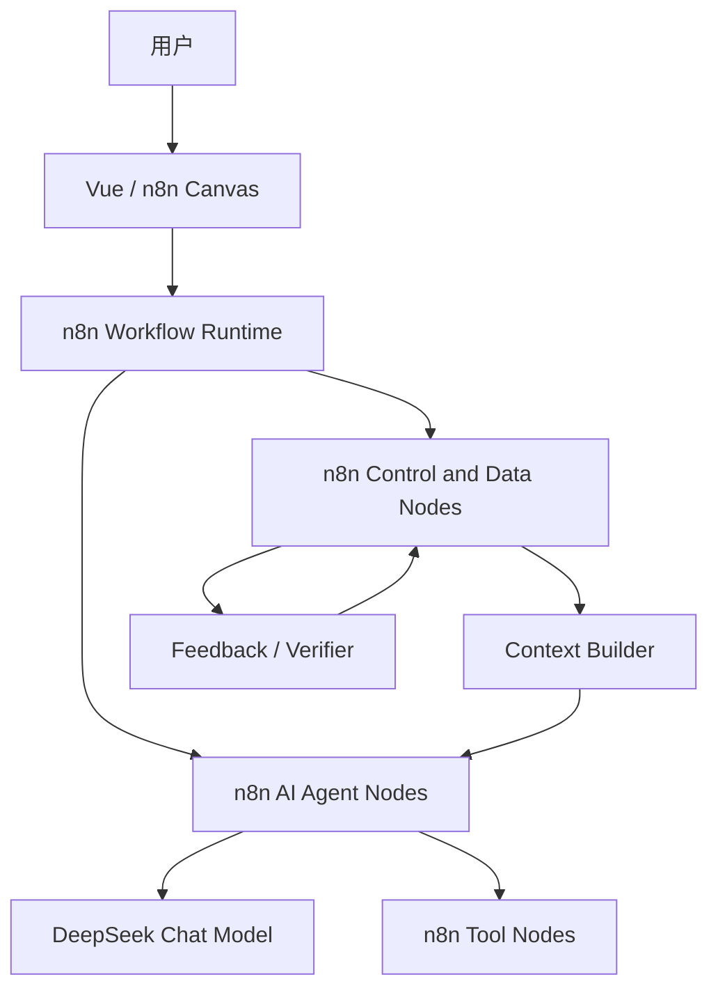
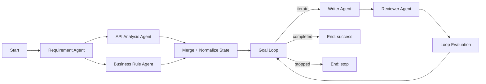

# Talent-AI：基于 n8n 的多 Agent 与 Loop Engineering 工作流平台

设计文档 v1.4｜2026-09-17

> 本文是基础版本的开发设计稿。文中“支持”“实现”均指交付目标；已经由官方文档或源码确认的能力与仍需本地验证的能力会分别说明，不把方案设计表述成已完成成果。

## 一、需求分析

### 1.1 项目目标

本项目用于完成面试开发任务：基于 n8n 实现一套支持多 Agent 编排、能够完成 Loop Engineering 的 AI 工作流平台，并交付设计文档、平台源码和可运行演示。

平台定位为通用 AI 工作流平台，软件开发是后续重点场景。基础版本先用一条半结构化任务工作流证明三个核心能力：

1. 用户可以在可视化画布上编排 AI 工作流；
2. 多个职责不同的 Agent 节点能够显式协作和交接数据；
3. 当前结果不满足验收条件时，系统能够依据反馈自动生成下一轮上下文并再次执行。

“平台使用工作流开发平台自身”作为独立进阶链路实现。该链路通过 Codex Coding Agent 在隔离 Git worktree 修改源码，并把测试证据交给原生 Loop Engineering 裁决，不改变基础 Demo 的依赖关系。

技术路线确定为复用 n8n 的 Vue 前端、Node.js 后端、工作流画布、原生 AI Agent、模型、工具、控制节点和执行记录。基础版本统一使用 n8n 原生 AI Agent，演示模型优先选择 DeepSeek。

### 1.2 核心概念

| 概念 | 本项目中的定义 | 画布及运行中的证据 |
|---|---|---|
| AI Workflow | 模型、工具、数据处理和控制逻辑组成的可执行流程 | 用户能看到、配置并运行完整工作流 |
| Multi-Agent | 多个职责不同的 AI Agent 节点通过工作流显式协作 | 每个 Agent 都是独立画布节点，具有独立 System Prompt、模型、Tool 和输出 |
| Agent 编排 | 用户决定 Agent 的串行、分支、条件路由、汇总和反馈关系 | 连线直接呈现任务依赖和数据流向 |
| Loop Engineering | 结果经过独立验证后，将结构化反馈和必要历史构造成下一轮输入，持续改进到通过或达到边界 | 能看到轮次、失败原因、下一轮输入和最终退出原因 |
| 自举开发 | 平台上的工作流修改、测试和改进平台自身 | 作为进阶版本单独验收 |

多 Agent 不等于并行。基础版本要求的是多个 Agent 的职责分工和数据交接；分支可以存在，但 wall-clock 并行只有在固定 n8n 版本中完成实际验证后才能作为正式能力，不为此重写调度层。

### 1.3 两层 Loop

设计中必须区分两种循环：

- **内层 Agent Loop**：n8n AI Agent 节点内部的 `LLM → Tool → Tool Result → LLM`。它解决一个 Agent 在单次节点执行中如何选择并使用工具。
- **外层 Engineering Loop**：工作流层的 `执行 → Reviewer → Feedback/Verifier → Context Builder → 再执行`。它解决一个产物如何根据独立验收反馈跨轮改进。

本项目新增的是外层 Loop Engineering 语义。不能因为 AI Agent 在内部调用了多次 Tool，就认为整条工作流已经支持 Loop Engineering。

### 1.4 基础版范围

基础版本包含：

- 固定版本 n8n 的本地安装与运行；
- 原生 AI Agent、DeepSeek Chat Model 和 Tool Calling；
- 多个 Agent 节点的串行、分支、条件路由和结果汇总；
- `Goal Loop` 与 `Loop Evaluation` 两个原生节点；
- 基于 Node Group 的 `Loop Region` 语义、拓扑校验与导入导出；
- 同次 Workflow Execution 内的循环状态、内置 Context Builder 与有界退出；
- Round Timeline、结构化运行结果和可复现 Demo。

本地 Codex 接入、宿主运行服务、worktree 隔离和自举 Demo 已作为进阶能力加入当前源码。跨任务长期记忆、Agent 配置中心、Skill Registry、Skill 自动沉淀、动态 Master 编排、复杂并行调度和跨主机运行仍属于后续范围。

## 二、设计思路

### 2.1 最大程度复用 n8n

基础版本不重写 n8n 已有能力。不同专家直接使用原生 AI Agent 节点，通过不同 System Prompt、模型参数和 Tool 配置体现职责差异；用户从画布连线理解各 Agent 的关系，不把多个 Agent 隐藏在“Agent 任务”或“并行团队”节点内部。

设计基线固定为 **n8n 2.38.7**，发布标签 `n8n@2.38.7`，本次 Codex Coding Agent 开发前的本地源码基线提交为 `121f785f`。该版本根目录配置要求 Node.js ≥24、pnpm ≥11.22，开发统一使用 Node.js 24.x 与 pnpm 11.22.0，并保留上游锁文件。版本与环境依据来自[发布记录](https://github.com/n8n-io/n8n/releases/tag/n8n%402.38.7)和本地固定源码。

| 能力 | 基础版处理方式 |
|---|---|
| 画布、连线、保存、运行和执行记录 | 复用 n8n |
| 专家 Agent | 复用 n8n AI Agent，每个专家对应一个独立节点 |
| 模型 | 使用 n8n DeepSeek Chat Model；模型名和凭据由节点配置 |
| 工具 | 使用 n8n 可连接到 AI Agent 的 Tool 节点 |
| 分支、条件和汇总 | 复用 IF、Switch、Merge、Code、Edit Fields（Set）等节点 |
| Loop State | 由 Goal Loop 保存到当前 Workflow Execution 的 node context |
| Feedback 与下一轮上下文 | Loop Evaluation 统一协议；Goal Loop 内置 Context Builder |
| Loop Region | 扩展现有 Node Group，保存控制器和评审节点引用 |
| 运行观察 | Goal Loop metadata + Group 标题状态 + Round Timeline |

n8n 官方文档已列出可与对话 Agent 配合的 [DeepSeek Chat Model](https://docs.n8n.io/integrations/builtin/cluster-nodes/sub-nodes/n8n-nodes-langchain.lmchatdeepseek)；固定版本中的实际模型调用、JSON 输出和 Tool Calling 仍以第一阶段的本地运行结果为准。

### 2.2 显式的多 Agent 协作

一个 Agent 节点表示一个职责明确的专家。例如：

```text
Requirement Agent → Analysis Agent → Writer Agent → Reviewer Agent
```

每个 Agent 在自己的节点中配置：

- System Prompt：职责、输入边界、工作步骤和输出约束；
- Chat Model：基础版本使用 DeepSeek，可按节点设置参数；
- Tools：仅连接完成该职责需要的工具；
- 输入映射：从 Workflow State 或上游节点选择必要字段；
- 输出格式：优先采用约定的 JSON 结构，便于下游解析和汇总。

存在多个独立分析角度时，可以把多个 Agent 放到不同画布分支，再通过 Merge 和 Code 节点聚合。基础验收只证明分支结构和数据汇总正确。只有执行时间证明确实重叠时，才在演示中称为并行。

这种方式借鉴 CrewAI 的角色分工、Paperclip 和 Multica 的任务交接思想，以及 NanoForge 的专家职责和选择性上下文设计，但基础版本不引入这些框架的运行时。

### 2.3 将反馈与上下文提升为一等语义

n8n 已能通过普通节点组合出反馈回路。本项目的新增价值不是宣称 n8n 或 Dify 无法实现循环，而是把两项容易散落在提示词和 Code 节点中的能力抽象为清晰、可配置、可观察的语义：

- **Feedback/Verifier** 统一确定性规则与 Reviewer Agent 结果，输出 `pass / fail / blocked`、问题列表和可执行反馈；
- **Context Builder** 根据稳定目标、验收标准、当前结果、上一轮反馈和必要历史，生成下一轮 Agent 输入。

03A/03B/03C 已用 Code 节点验证 JSON 输入输出和完整 Loop。原生版本进一步收敛为两个平台节点：`Goal Loop` 持有状态、构造上下文并裁决出口；`Loop Evaluation` 只规范确定性检查和 Reviewer 结果，不在节点内部再次调用模型。

### 2.4 保持基础架构轻量

基础版本不增加本地执行服务或独立数据库。Agent 之间的数据由 n8n 节点输出传递；轮次状态保存在同一次 Workflow Execution 的 JSON Payload 中；运行观察直接使用 n8n 的画布和执行记录。

Skill 系统暂不建设。基础版本通过 `System Prompt + Tools` 表达专家能力，不实现 Skill 文件管理、版本快照和 Registry。如果固定 n8n 版本存在能直接复用且经过验证的 Skill 能力，再作为兼容增强接入，不作为基础闭环的依赖。

同理，基础版本不做跨任务长期记忆。外层 Loop 需要的是同一次执行内的状态与历史摘要；“第二天继续”“跨 Workflow 查询”“长期产物管理”和从历史任务中召回经验时，再设计独立持久化。

### 2.5 Demo 选择

基础 Demo 采用“生成接口测试方案”：用户输入接口定义和若干业务规则，多个 Agent 分别分析需求与覆盖点，Writer Agent 生成结构化测试用例，Reviewer Agent 评审覆盖情况；如果结果不满足规则，Feedback/Verifier 产生缺失项，Context Builder 据此生成下一轮输入并重新生成。

这个场景有三项优势：输出结构可以确定、验收条件可以部分程序化、结果仍需要 Agent 的语义判断，能够在一张图中同时展示 AI Workflow、Multi-Agent 和 Loop Engineering。自举 Demo 放到进阶版本，不参与基础阶段的架构约束。

## 三、设计方案

### 3.1 总体架构



基础版本所有运行逻辑位于 n8n Workflow Execution 内。n8n 自身继续负责凭据、工作流定义和执行记录；Talent-AI 增加 Goal Loop、Loop Evaluation、Loop Region 和 Round Timeline。循环状态写入当前执行的 node context，轮次摘要写入已有 task metadata，不新增运行记录表。

源码交付包括固定版本 n8n、两个自定义节点包、可导入的 Demo Workflow、环境变量示例、启动说明和验证记录。开发分支保留上游许可、固定版本和本项目改动说明。

### 3.2 Workflow State

整条工作流传递一份 JSON 状态，节点只更新自己负责的字段，不另建 Run、Round、Task、Artifact 表。

```json
{
  "goal": "根据接口定义和业务规则生成接口测试方案",
  "acceptanceCriteria": [],
  "round": 1,
  "maxRounds": 3,
  "preLoop": {
    "requirements": {},
    "analyses": []
  },
  "currentResult": null,
  "review": null,
  "feedback": null,
  "historySummary": [],
  "status": "running"
}
```

核心字段定义如下：

| 字段 | 说明 | 更新者 |
|---|---|---|
| `goal` | 用户原始目标，循环过程中不得丢失 | Start / Edit Fields |
| `acceptanceCriteria` | 可检查的验收条件 | Requirement Agent 后的整理节点 |
| `round` | 当前外层轮次，从 1 开始 | Feedback/Verifier 或循环控制 Code |
| `maxRounds` | 最大轮数，基础 Demo 默认 3 | Start / Edit Fields |
| `preLoop` | 只执行一次的需求和分析结果 | Pre-Loop Agent 与 Merge |
| `currentResult` | Writer/Executor Agent 当前轮产物 | Writer/Executor Agent 后的整理节点 |
| `review` | Reviewer Agent 的结构化评审 | Reviewer Agent |
| `feedback` | 统一验证状态、问题和下一轮建议 | Feedback/Verifier |
| `historySummary` | 每轮结果与反馈的精简记录 | Feedback/Verifier |
| `status` | `running / success / failed / blocked` | Feedback/Verifier / 退出分支 |

每个 AI Agent 输出后先经过 Edit Fields 或 Code 节点，把模型结果规范为确定字段，再合并回 Workflow State。不能把未经解析的一整段模型文本直接当作控制条件。

### 3.3 多 Agent 数据交接

基础 Demo 中的职责如下：

| Agent | 职责 | 主要输入 | 结构化输出 |
|---|---|---|---|
| Requirement Agent | 提取接口定义、业务规则与验收标准 | 用户输入 | 接口信息、规则清单、验收项 |
| API Analysis Agent | 分析正常、异常、边界和协议层测试点 | Requirement 输出 | 覆盖点及理由 |
| Business Rule Agent | 分析业务约束、状态变化和组合场景 | Requirement 输出 | 业务测试点及风险 |
| Writer Agent | 生成或修订完整接口测试方案 | Pre-Loop 结果、当前 Context | 结构化测试用例集合 |
| Reviewer Agent | 按验收标准独立评审当前方案 | 当前结果、验收标准 | 通过建议、缺失项和问题列表 |

两个 Analysis Agent 可以构成分支，并在 Merge 后由 Code 节点按来源字段聚合。若固定版本实际执行为顺序，功能仍然成立；若实测起止时间重叠，再记录为并行能力。Merge 后必须检查两类分析结果均存在，不能因某条分支缺失仍进入 Writer。

n8n 支持在表达式中引用较早节点以及不同分支的数据，[官方数据映射说明](https://docs.n8n.io/data/data-mapping/data-mapping-ui/)可作为配置依据；具体 Merge 模式、Item Linking 和 AI 子节点对多 Item 的处理必须在固定版本中用最小工作流验证。特别是 DeepSeek Chat Model 属于 sub-node，其表达式处理多 Item 时只解析第一项，因此分支结果应先聚合成单个 State Item，再传给 Agent。

### 3.4 Context Builder

Context Builder 是 Loop Body 的入口。它接收：

```text
原始 Goal
+ Acceptance Criteria
+ Pre-Loop 的稳定分析结果
+ Current Result
+ 上一轮 Feedback
+ 必要的 History Summary
= 下一轮 Writer/Executor Agent 输入
```

第一轮没有 `currentResult` 和 `feedback` 时，Context Builder 生成初始执行上下文；后续轮次突出未通过项和必须修改的内容，同时保留原始目标与验收标准。它不得重新调用 Requirement Agent 或重新生成 Pre-Loop 分析。

基础实现使用 Code 节点，输出至少包含：

```json
{
  "round": 2,
  "taskPrompt": "...",
  "mustKeep": [],
  "mustFix": [],
  "acceptanceCriteria": []
}
```

历史只保存每轮摘要、问题标识和修改方向，不叠加完整 Agent 推理或全部日志。稳定后封装为自定义节点，提供字段映射、Prompt 模板、历史保留轮数和最大长度配置，并在执行详情中展示本轮构造结果。

### 3.5 Feedback/Verifier

Feedback/Verifier 将以下信息统一为结构化结果：

1. Code 节点可确定检查的规则，例如必填字段、用例数量、唯一 ID、每条用例是否包含前置条件、步骤和预期结果；
2. Reviewer Agent 对语义覆盖、业务规则遗漏、用例合理性等内容的结构化评审；
3. 上游节点是否产生合法、完整的 JSON。

输出格式至少为：

```json
{
  "result": "fail",
  "passed": false,
  "blocked": false,
  "issues": [],
  "feedback": "...",
  "nextAction": "retry"
}
```

`result` 只能是 `pass / fail / blocked`。所有必选确定性检查通过，并且 Reviewer 没有阻断问题时，才允许 `passed=true`。Writer Agent 自己声称“已完成”不作为结束依据；无法解析输出、模型鉴权失败或必要输入缺失也不能记为通过。

基础实现使用 Code 节点。稳定后封装的自定义节点提供规则列表、Reviewer 字段映射、通过策略和结构化结果预览，不在节点内部再次调用模型。

### 3.6 原生 Loop Region 与外层反馈回路

产品上的 Loop 由语义化的 Loop Region 表达。Region 内必须有且只有一个 Goal Loop 和一个 Loop Evaluation。Pre-Loop 区域只执行一次，失败后由 Goal Loop 构造下一轮上下文，再进入循环体。



退出条件保持简单且有界：

| 条件 | 动作 |
|---|---|
| 必选检查全部通过，Reviewer 达到阈值 | 从 `completed` 输出最终方案 |
| 未通过且仍可改进 | 记录摘要、`round + 1`，从 `iterate` 进入下一轮 |
| Reviewer 返回 `blocked` | 从 `stopped` 输出并保留证据 |
| 连续无改进 | 设置 `status=stagnated` 并停止 |
| 达到 `maxRounds` | 从 `stopped` 返回历史最佳产物和剩余问题 |

Loop Region 拓扑要求：外部输入只进入 Goal Loop；`iterate` 只进入循环体；所有分支在 Loop Evaluation 前汇合；Loop Evaluation 只回连 Goal Loop；外部输出只来自 Goal Loop 的 `completed` 或 `stopped`。Trigger 和 Pre-Loop 节点不能放入 Region。非法拓扑在保存时给出具体错误。

30 分钟总时限、无进展检测、跨进程取消传播、人工续跑和执行恢复均作为后续增强，不进入基础验收。

### 3.7 基础 Demo 运行设计

Demo 输入包含一份接口定义和若干业务规则，例如用户注册接口：请求字段、字段约束、重复注册规则、验证码规则、响应状态及错误码。目标是输出结构化接口测试方案。

演示步骤如下：

1. 在画布展示每个 Agent 的职责、DeepSeek 模型、Tool 和连线关系；
2. 从 Chat Trigger 或 Manual Trigger 输入接口定义与业务规则；
3. 展示 Requirement Agent 的结构化需求和两个 Analysis Agent 的不同分析结果；
4. 展示 Merge 后只有一个 Workflow State Item，并进入 Context Builder；
5. 展示 Writer 产物、Reviewer 评审及 Feedback/Verifier 的规则证据；
6. 若失败，展示 `issues` 如何进入下一轮 Context，再对比新旧测试方案；若通过，展示成功退出；
7. 展示达到 `maxRounds` 或使用阻塞输入时的停止分支，证明 Loop 有界。

测试方案的最小验收项包括：覆盖所有输入字段和业务规则；包含正常、异常、边界与组合场景；每条用例具有唯一 ID、标题、前置条件、请求数据、执行步骤和预期结果；每条业务规则能够映射到至少一个用例；输出 JSON 可以被下游节点解析。

Loop 是否一定在现场首轮失败不可依赖模型运气。开发阶段保留一条真实出现过缺失项并被后续轮次修复的执行记录或录屏；现场实时运行若首轮直接通过，就如实展示通过分支，再使用一份确实缺少必要接口信息的输入展示 `blocked`，不伪造失败结果。

### 3.8 Codex Coding Agent 与后续进阶

当前源码已经完成第 3、4 项的第一版。其余能力按以下顺序继续扩展：

1. 将 Context Builder 和 Feedback/Verifier 两个 Code 节点封装为正式自定义节点；
2. 验证并增强画布分支的实际并发能力与运行观测；
3. 已接入本机 Codex App Server，并增加受控的宿主运行服务、代码 worktree 和独立测试；
4. 已提供“平台修改平台自身”的 `05-self-bootstrap.json` 自举工作流；
5. 有跨天恢复、跨 Workflow 查询和长期产物需求时，引入独立状态库；
6. 有跨任务经验复用需求时，再设计 Skill 与长期记忆系统。

自举工作流仍沿用同一个外层循环模型，但执行 Agent 换为编码 Agent，Feedback/Verifier 接收独立测试和构建结果。该设计不会反向成为基础 Demo 的依赖。

## 四、实现功能

### 4.1 基础版功能清单

| 功能 | 交付内容 | 实现方式 |
|---|---|---|
| 工作流编排 | 创建、编辑、保存和运行流程 | 复用 n8n Vue 画布与 Runtime |
| 原生 Agent | 配置不同专家职责、模型与工具 | n8n AI Agent + DeepSeek + Tool |
| 多 Agent 协作 | 串行、分支、条件路由与汇总 | 画布独立 Agent 节点 + 原生控制节点 |
| Loop State | 同次执行内保存目标、轮次、最佳结果和反馈摘要 | Goal Loop node context |
| 上下文构造 | 为首轮或下一轮生成明确且有界的输入 | Goal Loop 内置 Context Builder |
| 反馈验证 | 汇总规则检查和 Reviewer 结果 | `LoopEvaluationV1` + Loop Evaluation |
| 有界 Loop | 通过、重试、阻塞、停滞和最大轮次退出 | Goal Loop 三出口 |
| Loop Region | 创建、保存、复制并校验循环子图 | 语义 Node Group |
| 运行观察 | 查看每轮分数、失败检查、状态和退出原因 | task metadata + Round Timeline |
| Demo | 第二轮修复缺陷接口测试方案 | `04-native-loop.json` |
| Codex 编码执行 | 每次执行创建隔离分支、worktree 和 Codex thread | Codex Coding Agent + App Server |
| 自举 Demo | Codex 修改平台节点、运行固定验证并接受 Reviewer 评审 | `05-self-bootstrap.json` |

### 4.2 基础版验收

| 验收项 | 通过条件 |
|---|---|
| 单 Agent 可用 | AI Agent 能使用 DeepSeek 完成请求，并至少验证一个 Tool Calling |
| 多 Agent 成立 | 至少三个不同职责 Agent 作为独立节点出现，输入输出可追踪 |
| 数据交接正确 | 串行与分支汇总后均得到约定 JSON，来源和字段不丢失 |
| 两层 Loop 可区分 | 能分别说明并展示 Agent 内部 Tool Loop 与工作流外部反馈 Loop |
| Feedback 独立 | 是否完成由规则和 Reviewer 决定，不使用 Writer 的自我声明 |
| Context 有效 | 下一轮输入包含原始目标、验收标准、上一轮结果和具体反馈 |
| 外层 Loop 有效 | `completed / retry / blocked / stagnated / max_rounds` 路由符合状态 |
| Region 完整 | 导出再导入、复制和节点 ID 重生成后仍引用正确控制器与评审节点 |
| Demo 可复现 | `04-native-loop.json` 可导入，Pre-Loop 只运行一次，第二轮通过 |

真实并行、长期状态、Skill 和长期记忆不属于基础版验收项。Codex 与自举作为进阶展示，不能替代核心闭环。

### 4.3 开发顺序

开发严格按最小可验证路径推进：

1. **固定底座**：fork 或取得 `n8n@2.38.7` 源码，完成安装、开发启动和最小改动构建验证。
2. **验证单 Agent**：搭建 `Chat Trigger → AI Agent → DeepSeek Chat Model → Tool`，确认凭据、模型响应、JSON 输出和 Tool Calling。
3. **验证串行交接**：搭建 `Agent A → Agent B → Agent C`，确认不同 System Prompt、生效的输入映射和 JSON 传递。
4. **验证分支与汇总**：搭建两个 Analysis Agent 分支和 `Merge → Code`，确认每个分支的来源、Item 数量、聚合结果和执行顺序；实测后再判断是否能称为并行。
5. **定义 Workflow State**：统一字段并让每个节点只更新自己负责的数据，先跑通 Pre-Loop 到 Writer 的单轮路径。
6. **实现 Feedback 原型**：用 Reviewer Agent + Code 节点完成确定性检查、结构化反馈和退出判断。
7. **实现 Context Builder 原型**：用 Code 节点根据 State 生成下一轮输入，接回 Loop Body，跑通 `pass / retry / blocked / maxRounds`。
8. **固化基础 Demo**：完成接口测试方案 Workflow、示例输入、真实执行记录、运行说明和录屏。
9. **封装原生能力**：实现 Goal Loop、Loop Evaluation、Loop Region、保存校验和 Round Timeline，并回归旧 Group。
10. **固化原生 Demo**：用 04 证明业务节点不再负责循环状态、裁决和上下文构建。
11. **进入进阶版本**：接入 Codex 与自举，再处理长期状态、Skill、复杂并行和增强界面。

这一顺序与开发 Demo 使用同一条能力链，每一步的输出都成为下一步的输入，不需要先完成完整平台再定位问题。

### 4.4 交付物与状态边界

基础版交付：本设计文档、固定上游版本的平台源码、Goal Loop 与 Loop Evaluation、Loop Region 画布能力、可导入的 Demo Workflow、DeepSeek 与环境变量配置说明、示例输入、启动步骤、验收记录及可选录屏。配置文件不得包含真实密钥。

当前源码已加入原生节点、公共协议、Loop Region 保存校验、创建动作、导入 ID 重映射和 Round Timeline。固定样本控制测试不等于真实模型改善；DeepSeek 输出质量、真实 Agent 分支和现场实例导入仍需分别留下运行证据。

开发阶段必须按照 4.3 的顺序留下真实验证结果。某项未跑通前，在文档、演示和简历中只能称为设计目标或原型，不能称为已实现能力。

### 4.5 Loop 原型实施记录（2026-09-15）

已提供[Loop Demo 导入文件与使用说明](workflows/loop-engineering/README.md)，包含固定样本控制测试版和真实模型版。原型沿用注册接口场景，Pre-Loop 暂时使用串行 Requirement / Analysis，重点验证 Context Builder、独立 Reviewer、确定性 Feedback/Verifier 和有界回边；分支与 Merge 尚未纳入本次原型。

本地脚本检查和固定版本 n8n 调度器检查已通过：首轮通过、失败后第二轮通过、达到轮数上限、无效 JSON 阻塞、输入缺失阻塞。调度器检查使用原生 IF 和 Manual Trigger，Code 使用本地 VM 适配器；浏览器导入、原生 Code task runner 和真实模型跨轮改善仍待实例验证。固定样本不是模型执行结果，不作为性能或改善效果证据。

### 4.6 原生 Loop Engineering 实施记录（2026-09-17）

本次实现把 03 系列中由 Code、IF 和人工连线承担的控制职责提升为平台语义：

- `Goal Loop` 使用当前执行的 node context 保存 `LoopStateV1`，内置下一轮 Context Builder，并提供 `iterate / completed / stopped` 三个出口；
- `Loop Evaluation` 把确定性检查、Reviewer 结果、产物和额外上下文规范为 `LoopEvaluationV1`；
- `IWorkflowGroup.kind='loop'` 保存控制器与评审节点引用，保存路径校验边界、回边、唯一节点和汇合规则；
- 选中单入口、单出口业务子图后可执行 **Create Loop Region**，平台自动插入两个原生节点、重接外部边并建立反馈边；
- Goal Loop 使用既有 task metadata 记录轮次、分数、历史最佳、失败检查和退出原因，Group 标题栏展示状态徽标和 Round Timeline；
- `04-native-loop.json` 使用固定业务夹具保证第一轮失败、第二轮通过。Code 节点只模拟 Writer 与测试证据，不管理循环状态、裁决或下一轮上下文。

第一版 Loop 状态只保证单次 Workflow Execution 内有效。跨重启恢复和人工暂停继续仍属于后续能力。Codex Coding Agent 已让每次 Workflow Execution 创建一个 thread，同次执行的多轮共享该 thread，并把测试结果转换为 `LoopEvaluationV1`，由 Goal Loop 统一裁决。

### 4.7 Codex Coding Agent 与自举实施记录（2026-09-17）

Codex Coding Agent 是独立工作流节点。节点只接受仓库 ID、任务、Goal、验证配置名、模型、推理强度和超时。工作流不能传入任意目录、Shell 文本、网络开关、审批策略或 `CODEX_HOME`。

宿主侧 `CodexCodingModule` 负责以下生命周期：

1. 从服务端白名单解析仓库与固定验证配置；
2. 检查主仓库必须有 HEAD，且没有未提交或未跟踪文件；
3. 从当前 HEAD 创建 `talent-ai/codex/<execution>-<node>` 分支和独立 worktree；
4. 启动并握手 `codex app-server --listen stdio://`；
5. 首轮创建 Codex thread，后续 Loop 轮次恢复同一 thread 并创建新 turn；
6. 固定使用 `approvalPolicy=never`、`workspaceWrite`、worktree 唯一可写根和禁用网络；
7. 拒绝意外审批、用户输入和权限扩展请求，避免节点无限等待；
8. Codex turn 完成后，由宿主以 `shell:false` 运行管理员配置的命令；
9. 记录 branch、base commit、changed files、diff、测试证据、token usage 和错误；
10. 保留 worktree 和分支供人工审查，不自动 merge、push、stash、reset 或删除现场。

`codex_coding_run` 使用 `(workflowExecutionId, nodeId)` 唯一定位一次运行。`codex_coding_turn` 保存每轮 turn、Loop round、摘要、usage、检查结果和 diff artifact。App Server 重启后可用数据库中的 thread ID 调用 `thread/resume`。正在执行的 turn 若遇到进程崩溃会标记失败并保留 worktree，不自动重放。

执行详情的 **Codex Run** 卡片展示 Thread、Turn、Round、状态、分支、base commit、diff stat 和每项验证结果。`View Diff` 通过带项目权限检查的后端接口读取完整 diff artifact。

自举 Demo 位于 `workflows/codex-coding/05-self-bootstrap.json`。使用步骤如下：

1. 双击 `启动n8n.cmd`。脚本注入 Talent-AI 仓库白名单、离线且禁用安装钩子的准备步骤，以及 `codex-node-targeted` 验证配置；
2. 导入 05 工作流，并为 DeepSeek Review Model 选择已有凭据；
3. 确认主仓库干净后执行工作流；
4. Codex 在隔离 worktree 为自身节点增加一个小功能和单元测试；
5. 平台运行固定测试与类型检查，Reviewer 对 diff 和证据评分；
6. 失败证据由 Goal Loop 写入同一 Codex thread 的下一轮；
7. 完成后在输出和 Codex Run 卡片查看分支、修改文件、diff 与检查结果。

2026-09-17 本机端到端验收已通过：Workflow Execution `65` 从基线 `c135feb8` 创建隔离分支 `talent-ai/codex/65-51000000-000`，Codex thread `01a0af4b-6594-74e1-8d3c-7435759fa751` 在首轮完成真实源码与测试修改；宿主验证得到 7 个节点测试通过、`n8n-nodes-base` 类型检查通过，DeepSeek Reviewer 得分 88 并返回 `pass`，Goal Loop 从 `completed` 出口结束。完整 diff 已作为 8,387 字节 artifact 保存，主工作目录在执行前后均保持干净；隔离分支和 worktree 按设计保留供人工审查。

当前第一版限定在原生 Windows 单机主进程。queue mode、远程 worker、多用户独立 Codex 身份、Promote Changes、自动合并和自动推送属于下一阶段。
