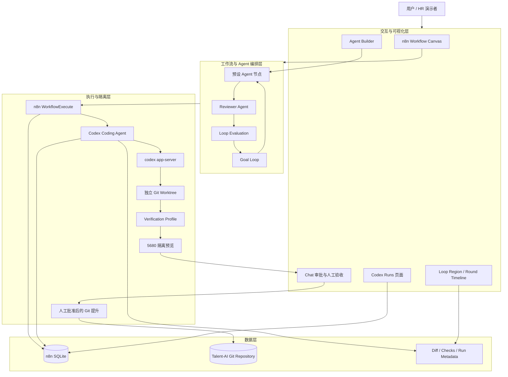
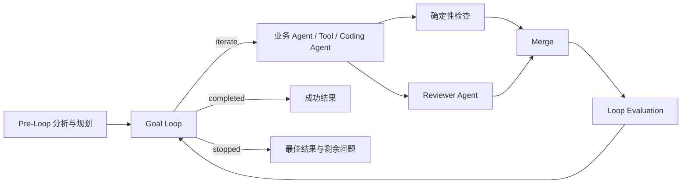
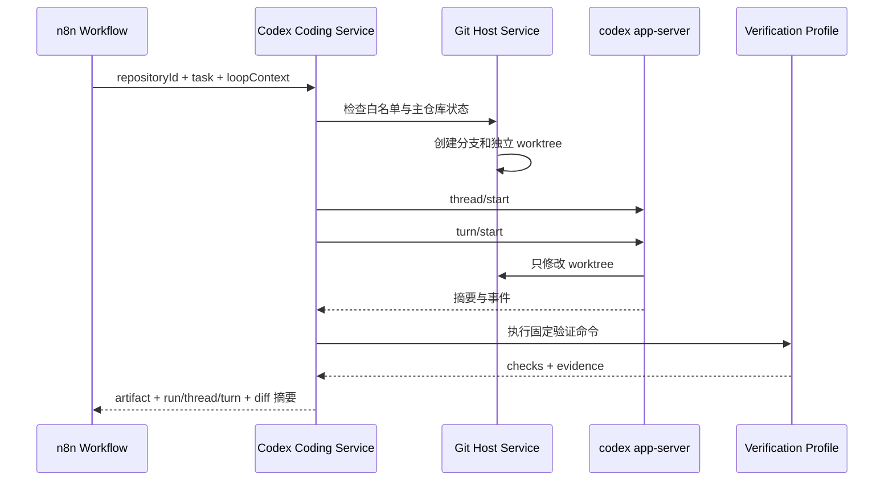
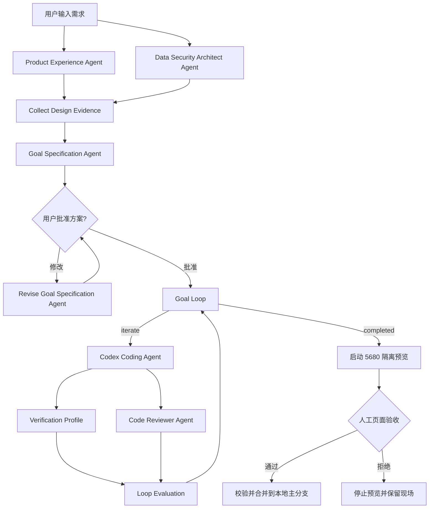

# Talent-AI 最终设计文档

> 版本：v2.0（交付版）<br>
> 日期：2026-09-18<br>
> 项目实现提交：`f45702f5286cd9dd841e705308e42c769a987364`<br>
> n8n 基线：`n8n@2.38.7` / `a2d0f7638bbb7582e33a4dfa1537eeb8ff066788`<br>
> 本机验证环境：Windows、Node.js 24.x、pnpm 11.22.0、Codex CLI 0.155.0

---

## 1. 项目结论

Talent-AI 是一个在 n8n 源码基础上扩展的多 Agent 工作流平台原型。项目没有重写工作流引擎，而是复用 n8n 已成熟的画布、节点、凭据、执行记录和调度能力，把研发重点放在原平台缺少的三类能力上：

1. **可复用的预设 Agent**：Agent 拥有独立身份、指令、Skill、Tool 配置和版本，不必在每条工作流中重复编写角色提示词。
2. **平台原生 Loop Engineering**：由 Goal Loop、Loop Evaluation、Loop Region 和 Round Timeline 共同管理目标、评审、反馈、下一轮上下文和停止条件，用户不再用 Code Node 手写循环控制器。
3. **可审查的自举开发**：Codex Coding Agent 在隔离 Git worktree 中修改 Talent-AI，自举工作流完成需求分析、目标确认、编码、自动验证、人工预览和受控合并，运行中的主实例不会被直接修改。

项目已经跑通一条完整的自举演示链路：用户提出“为 Codex Runs 页面增加刷新按钮和最近刷新时间”，多个 Agent 生成并确认方案，Codex 在隔离 worktree 中完成修改，平台执行自动检查，在 5680 端口启动隔离实例，用户完成页面验收。当前修改仍保留在隔离 worktree，尚未合并，这正是人工合并关卡按设计生效的结果。

### 1.1 当前完成度

| 能力 | 当前状态 | 可核验证据 |
| --- | --- | --- |
| n8n 源码本地构建与运行 | 已实现 | 根目录双击启动/关闭脚本；本地 5678 实例 |
| 预设 Agent | 已实现 | SQLite 中现有 4 个 Agent，均有激活版本和 Skill |
| Skill 文件夹导入 | 已实现 | 支持 `SKILL.md`、references、templates、scripts、assets、examples 等文本文件 |
| 多 Agent 工作流 | 已实现 | 06 Demo 含产品、架构、规划、修订、编码、评审等角色 |
| 原生 Loop Engineering | 已实现 | Goal Loop、Loop Evaluation、Loop Region、Round Timeline |
| Loop 两轮调度 | 已验证 | 原生调度测试通过，Pre-Loop 仅执行一次，第二轮收到有界反馈 |
| Codex Coding Agent | 已实现 | App Server、线程复用、worktree、验证配置、运行记录 |
| Codex Runs 可视化 | 已实现 | 项目级只读页面与 API 展示 Run/Turn 数据 |
| 自举隔离预览 | 已实现并人工验证 | 5680 预览实例、独立数据库副本、页面验收关卡 |
| 审批后本地合并 | 已实现，当前 Demo 未执行 | 校验补丁哈希后提交分支并 `--no-ff` 合并，不自动 push |
| 自定义向量长期记忆 | 未实现 | 当前使用 n8n 的会话/Agent 数据能力，未加入自定义向量记忆管线 |
| 跨机器、多人 Codex Runtime | 未实现 | 当前面向 Windows 单机演示，并发默认为 1 |

---

## 2. 背景与设计判断

### 2.1 为什么没有重写一个简化版 n8n

画布、节点模型、凭据管理、工作流导入导出、执行历史和错误处理都属于工作流平台的基础设施。短周期内重写这些能力，会把时间消耗在平台底座上，反而无法证明多 Agent、循环改进和自举开发。

本项目采用“**成熟底座 + 关键语义扩展**”的路线：

- n8n 继续承担通用工作流能力；
- Talent-AI 在源码层新增节点、公共协议、数据库实体、服务端 Runtime 和前端页面；
- Demo 使用普通 n8n 节点表达业务流程，同时使用 Talent-AI 原生节点承担目标循环和编码执行。

因此，这不是只在 n8n 画布上拼接一个普通工作流。Goal Loop、Loop Evaluation、Loop Region、Codex Coding Agent、Codex Runs、Skill 文件夹导入以及 worktree 人工提升流程都进入了平台源码或项目宿主脚本。

### 2.2 需求映射

| 面试需求 | Talent-AI 的实现 |
| --- | --- |
| 多 Agent 协作 | 每个 Agent 是显式节点；支持串行、分支汇合、规划与评审角色 |
| 任务拆分与委派 | 规划 Agent 生成目标、约束、验收标准和实现任务，经用户批准后交给执行 Agent |
| Loop Engineering | Goal Loop 维护轮次和状态，Loop Evaluation 统一测试与 Reviewer 结果 |
| 动态上下文 | 下一轮只注入目标、失败证据、评审意见、历史最佳和最近摘要 |
| 自己开发自己 | Codex Coding Agent 修改 Talent-AI 的隔离 worktree |
| 安全交付 | 自动检查后启动隔离实例，人工页面验收后才允许合并 |
| 过程可视化 | 画布、Round Timeline、Codex Runs 页面和工作流执行详情共同展示 |

---

## 3. 总体架构



### 3.1 分层职责

| 层 | 负责内容 |
| --- | --- |
| n8n 基础层 | 画布、节点连接、工作流执行、凭据、项目权限、执行历史 |
| Agent 层 | 角色指令、模型、Skill、Tool、版本和会话资源 |
| Loop 层 | 目标、验收标准、轮次、反馈、历史最佳、停止条件 |
| Coding Runtime 层 | Codex 会话、worktree、沙箱策略、验证命令和结果归一化 |
| Human-in-the-loop 层 | 方案批准、真实页面预览、最终合并批准 |

---

## 4. 预设 Agent

### 4.1 Agent 的边界

在 Talent-AI 中，预设 Agent 不是一段临时 Prompt，而是可在多条工作流中复用的版本化运行配置：

- `agentId`：标识一个预设 Agent；
- `projectId`：控制 Agent 所属项目和可见范围；
- Instruction：定义稳定角色与工作原则；
- Model：定义该 Agent 使用的模型配置；
- Skills：按任务渐进读取的领域知识包；
- Tools：Agent 可调用的外部能力；
- Resource/Thread：运行时资源与会话上下文；
- Version：保存配置变更并指向当前激活版本。

Agent 归属于 n8n Project。未发布或未共享到其他项目的 Agent，不会自然成为所有用户的全局资源。

### 4.2 当前预设 Agent 数据

截至 2026-09-18，本机 SQLite 中已创建 4 个预设 Agent：

| Agent | Skill 数 | Tool 数 | 当前状态 |
| --- | ---: | ---: | --- |
| AI 面试陪练官 | 3 | 0 | 有激活版本 |
| 健康生活私教 | 2 | 0 | 有激活版本 |
| 行业深度洞察专家 | 6 | 0 | 有激活版本 |
| 论文写作助手 | 9 | 0 | 有激活版本 |

这些 Agent 的 Tool 数目前为 0。这是当前导入数据的真实状态，不代表平台不支持 Tool；后续可按业务需要为单个 Agent 配置工具。

### 4.3 Instruction 精简原则

预设 Agent 的 Instruction 只保留稳定信息：

1. 角色身份；
2. 核心职责；
3. 输出风格；
4. 必须遵守的少量边界。

可更新的知识、模板、示例和操作步骤放入 Skill。用户画像、会话历史和长期记忆也不写入角色 Markdown，避免 Instruction 持续膨胀。

---

## 5. Skill 文件夹导入与渐进读取

### 5.1 实现目标

原始 Agent Builder 更适合上传单个 `SKILL.md`。Talent-AI 增加 **Upload folder**，允许导入结构化 Skill 包：

```text
skill-name/
├─ SKILL.md
├─ references/
├─ templates/
├─ scripts/
├─ assets/
├─ examples/
└─ README.md
```

### 5.2 运行方式

平台保存文件相对路径。Agent 先读取 `SKILL.md`，只有任务确实需要时才调用内置 `load_skill` 读取关联文件。这样可以保留复杂 Skill 包的扩展性，又不会一次把所有材料塞进模型上下文。

### 5.3 安全与容量边界

- 最多 128 个文本关联文件；
- 单文件最大 512 KB；
- Skill 包文本总量最大 2 MB；
- 忽略 `.env`、`.npmrc`、`.pypirc`、依赖和缓存目录；
- PNG、DOC、DOCX 等二进制文件跳过，并在界面提示；
- `scripts/` 中的脚本目前只作为可读源码，不直接执行。

脚本执行需要独立沙箱、路径白名单、超时、网络和审批策略，本版没有把“读取脚本”误等同于“执行脚本”。

---

## 6. 多 Agent 协作模型

Talent-AI 使用显式画布节点表达协作关系。每个 Agent 的输入、输出和责任都可以从画布和执行详情中检查。

### 6.1 支持的协作方式

| 方式 | 表达形式 | 适用场景 |
| --- | --- | --- |
| 串行 | Agent A → Agent B → Agent C | 需求分析、设计、实现依次推进 |
| 分支汇合 | 多个 Agent 分支 → Merge | 产品与技术分别分析，再统一规划 |
| Planner / Executor / Reviewer | 规划 → 执行 → 评审 | 有明确交付物和验收条件的任务 |
| Loop 协作 | 执行 → 测试/评审 → 反馈 → 再执行 | 需要根据证据逐轮修正的任务 |
| Human-in-the-loop | Agent 方案 → 用户批准 | 范围、风险或最终发布需要人确认 |

画布上的分支体现逻辑上的并行分析。本版没有改写 n8n 调度器，因此不对所有分支承诺真实的同时执行或墙钟时间加速。

### 6.2 06 Demo 的角色

| 节点 | 责任 |
| --- | --- |
| Product Experience Agent | 给出精简的用户体验和验收建议 |
| Data Security Architect Agent | 检查数据来源、权限和安全边界 |
| Goal Specification Agent | 把多方意见压缩为目标、约束、验收标准和编码任务 |
| Revise Goal Specification Agent | 根据用户修改意见修订方案 |
| Codex Coding Agent | 在隔离 worktree 中修改源码 |
| Code Reviewer Agent | 对结果做语义评审 |
| Goal Loop / Loop Evaluation | 维护状态、统一证据并决定继续或退出 |

---

## 7. 原生 Loop Engineering

### 7.1 为什么需要平台语义

普通工作流可以用 Code Node、IF 和回连模拟循环，但每个用户都要重新实现状态、反馈、轮次和停止条件，且难以统一展示。Talent-AI 把这些通用能力下沉为平台原生语义。



Pre-Loop 只运行一次。循环失败后回到 Goal Loop，由平台构造下一轮上下文，再进入循环体。

### 7.2 Goal Loop

Goal Loop 配置：

- Goal；
- Constraints；
- Acceptance Criteria；
- Maximum Rounds；
- Reviewer Pass Score；
- Stop After Stagnant Rounds；
- History Window；
- Additional Context。

三个输出：

- `iterate`：进入本轮执行；
- `completed`：验收通过；
- `stopped`：阻塞、停滞或达到最大轮次。

状态保存在当前 Workflow Execution 的 node context 中。新执行重新开始，避免调试时被旧执行污染。

### 7.3 Loop Evaluation

Loop Evaluation 把测试脚本、规则检查和 Reviewer Agent 的输出归一为统一协议：

```ts
interface LoopEvaluationV1 {
  version: 1;
  artifact: unknown;
  checks: Array<{
    id: string;
    kind: 'deterministic' | 'reviewer';
    required: boolean;
    passed: boolean;
    score?: number;
    message?: string;
    evidence?: unknown;
  }>;
  reviewer?: {
    score: number;
    verdict: 'pass' | 'revise' | 'blocked';
    summary: string;
    issues: unknown[];
  };
  extraContext?: unknown;
}
```

裁决优先级：

1. 任一必选确定性检查失败，不能通过；
2. 配置 Reviewer 时，分数还要达到阈值；
3. Reviewer 返回 `blocked` 时立即停止；
4. 连续无明显改进时判定 `stagnated`；
5. 达到最大轮次时返回历史最佳结果和剩余问题。

意外节点异常仍然是正常的 n8n 执行错误，不会被伪装成一次评审失败。

### 7.4 下一轮上下文

Goal Loop 不回灌完整对话和完整日志，只保留完成下一轮所需的信息：

1. 原始目标、约束和验收标准；
2. 当前产物；
3. 最新失败检查及证据；
4. Reviewer 问题和建议；
5. 历史最佳结果与分数变化；
6. 最近若干轮摘要；
7. 下一轮优先处理的 1～3 个问题。

这使上下文大小随轮次保持有界，并降低旧错误信息反复污染后续执行的风险。

### 7.5 Loop Region 与 Round Timeline

Loop Region 在普通 Group 上增加：

- `kind: 'loop'`；
- controllerNodeId；
- evaluatorNodeId；
- 保存时拓扑校验；
- 执行状态徽标和 Round Timeline。

编辑器可以把选中的单入口、单结果出口子图转换为 Loop Region，自动插入 Goal Loop 和 Loop Evaluation 并建立反馈边。非法入口、非法出口、缺失控制器、缺失评估器以及未汇合分支会被明确提示。

Round Timeline 来自既有 execution run data 和 task metadata，展示：

- 当前轮次和最大轮次；
- 当前分数和历史最佳；
- 失败检查；
- Running、Passed、Blocked、Stagnated 等状态；
- 退出原因。

### 7.6 当前验证结果

2026-09-18 重新执行原生调度验证：

```text
PASS: native Goal Loop completed in round 2.
PASS: Pre-Loop ran once and retry context contains bounded evidence.
PASS: execution metadata records the round timeline.
```

这组验证使用真实 `WorkflowExecute` 调度器，证明循环控制不是只写在设计文档里的状态机。

---

## 8. Codex Coding Agent

### 8.1 节点定位

Codex Coding Agent 是专用工作流节点，不向模型直接开放通用 Execute Command。工作流只提供：

- Repository：服务端白名单中的仓库 ID；
- Task：本轮编码任务；
- Goal：可选字段；
- Verification Profile：服务端预设验证方案；
- Model、Reasoning Effort、Timeout。

仓库绝对路径、任意 Shell、网络开关、审批策略和 `CODEX_HOME` 不由工作流输入，避免用户通过表达式扩大执行权限。

### 8.2 会话与 worktree 生命周期



规则如下：

- 第一次进入节点时，主仓库必须满足创建隔离环境的检查；
- worktree 是 Git 的链接工作目录，不是完整复制整个仓库历史；
- 同一个 Workflow Execution 再次进入同一个节点时复用 run、thread 和 worktree；
- 重新执行工作流时创建新的 run、thread、分支和 worktree；
- worktree 和分支默认保留，便于审查和故障恢复；
- 平台不自动 stash、reset、push 或删除有修改的 worktree。

### 8.3 App Server 与权限

后端 CodexCodingModule 管理本机 `codex app-server`：

- 完成 initialize 握手；
- 调用 `thread/start`、`thread/resume` 和 `turn/start`；
- 维护 JSON-RPC 请求、响应和通知路由；
- 处理超时、取消、进程异常和意外审批请求；
- n8n 关闭时终止子进程。

每次运行固定使用：

```ts
{
  approvalPolicy: 'never',
  sandboxPolicy: {
    type: 'workspaceWrite',
    writableRoots: [worktreePath],
    networkAccess: false,
  },
}
```

因此 Codex 可以在 worktree 内写代码和运行允许的本地任务，但不能写到主工作区或依赖联网完成任务。Git 生命周期由宿主服务控制，Codex 不负责直接合并主分支。

### 8.4 Goal 的归属

06 Demo 中 Codex Coding Agent 的 Goal 字段有意留空，平台以 **Goal Loop** 作为目标状态的唯一来源。原因是 Codex App Server 的独立 goals 功能曾依赖额外本地数据库能力，不适合作为当前演示的稳定前提。

这不表示 Demo 没有 Goal：目标、约束和验收标准由规划 Agent 生成、用户批准，并写入 Goal Loop；Codex 接收经过批准的具体 Task。未来 App Server goals 能力稳定后，可以再把平台 Goal 同步到 Codex thread。

### 8.5 Verification Profile 与 Reviewer 的关系

二者检查不同层面：

| 机制 | 负责问题 | 特点 |
| --- | --- | --- |
| Verification Profile | 能否构建、类型是否正确、目标测试是否通过、diff 是否合法 | 确定性、可重复，由宿主执行 |
| Reviewer Agent | 是否符合需求、交互是否合理、范围是否越界 | 语义判断，可能存在模型误差 |
| 人工预览 | 页面实际是否能用、视觉和操作是否符合预期 | 最终人类判断 |

当前预设：

| Profile | 用途 |
| --- | --- |
| `codex-node-targeted` | Codex Coding Agent 节点目标测试与 nodes-base 类型检查 |
| `codex-runs-sidebar-targeted` | Codex Runs 后端、前端相关测试和类型检查 |
| `codex-demo-fast` | 截止时间演示用快速检查，执行 `git diff --check` |

`codex-demo-fast` 不是完整质量门禁。06 Demo 通过 Reviewer 和隔离实例人工预览补齐语义与页面验证。

### 8.6 输出与持久记录

节点输出包括：

- runId、threadId、turnId、round；
- baseCommit、branchName、worktreePath；
- summary、changedFiles；
- 限长后的 diffStat 和 diffPreview；
- checks、status、error 和 token usage。

SQLite 新增两类记录：

- `codex_coding_run`：一次工作流执行中的编码运行；
- `codex_coding_turn`：该运行中的每一轮 Codex turn。

截至 2026-09-18，本机数据库有 6 条 Run 和 6 条 Turn。最新 Run `14da4e43-e98b-432c-a01d-fbaf66a0aec8` 状态为 `completed`，对应执行 86 和分支 `talent-ai/codex/86-62000000-000`。

---

## 9. Codex Runs 可视化

Talent-AI 在侧边栏增加 Codex Runs 入口，使用项目级只读 API 展示 SQLite 中的编码记录。

页面展示：

- Run 状态；
- Workflow Execution；
- Repository、branch 和 base commit；
- Codex thread / turn；
- 轮次与时间；
- 验证结果和错误摘要。

API 在服务端检查当前用户对 Project 的访问权限，前端不直接读取本地 SQLite 文件，也不接受数据库路径参数。

当前主分支已经包含 Codex Runs 页面。最新自举任务在隔离 worktree 中为该页面增加了 Refresh 按钮和最近刷新时间；该改动已通过构建和 5680 页面人工验收，但尚未执行最终合并。

---

## 10. 自举开发 Demo

### 10.1 Demo 目标

工作流文件：`workflows/codex-coding/06-codex-runs-sidebar-self-bootstrap.json`

当前需求：

> 为现有 Codex Runs 页面增加一个刷新按钮，并显示最近刷新时间；只修改现有前端页面和文案，不改数据库、后端 API、权限模型或路由。

### 10.2 完整流程



### 10.3 为什么 Demo 设置为一轮

06 的 Goal Loop 当前配置：

- `maxRounds = 1`；
- Reviewer 通过分数 60；
- Codex 模型 `gpt-5.6-sol`；
- reasoning effort 为 low；
- timeout 为 8 分钟；
- verification profile 为 `codex-demo-fast`。

这是为了在展示时间内稳定完成一次真实源码修改。原生 Loop Engineering 的多轮能力由 04 Demo 单独证明；06 重点证明“多 Agent 规划 + Codex 执行 + 自动检查 + 人工预览 + 受控提升”的完整链路。

### 10.4 隔离预览

自动检查通过后，宿主脚本执行：

1. 校验 worktree 位于允许目录；
2. 校验主分支与 worktree 基线关系；
3. 计算待预览补丁的 `changeHash`；
4. 构建受影响的前端包；
5. 为预览实例准备独立的 n8n 用户目录和 SQLite 副本；
6. 在 5680 启动 n8n，在 5681 启动任务运行器；
7. 轮询 `/healthz`，健康后把预览地址发回 Chat；
8. 等待用户打开页面并点击批准或拒绝。

预览不会修改 5678 主实例使用的数据库和运行目录。

### 10.5 最终提升

用户点击“预览通过并合并”后，固定脚本再次检查：

- 明确存在人工批准参数；
- worktree 路径在白名单根目录内；
- 当前补丁哈希与预览时完全一致；
- 主仓库状态允许提升；
- n8n 源码基线没有在预览后发生变化；
- 主分支与 worktree 没有重叠冲突修改。

随后脚本停止预览，提交隔离分支，并在本地主分支执行 `git merge --no-ff`。该步骤不会自动 push 到远程仓库。

如果用户拒绝，只停止预览并保留分支和 worktree，便于继续检查或修复。

### 10.6 当前 Demo 现场

最新 worktree：

```text
C:\Users\XuperMan\.n8n\codex-worktrees\talent-ai\86-62000000-000
```

实际修改：

```text
upstream/n8n/packages/frontend/@n8n/i18n/src/locales/en.json
upstream/n8n/packages/frontend/editor-ui/src/features/codexRuns/CodexRunsView.vue
```

共 2 个文件，70 行新增、22 行删除。用户已在 5680 隔离实例中确认功能可用，尚未点击最终合并。因此 5678 主实例保持原版本，符合“先验证、后提升”的安全目标。

---

## 11. 数据与标识关系

### 11.1 Agent 相关

```text
Project / 用户可访问范围
└─ Agent（agentId）
   ├─ Agent Version
   ├─ Skills / Tools
   └─ Resource（resourceId，业务主体或用户）
      └─ Thread（threadId，会话）
         └─ Messages / Memory Entries
```

- `agentId` 区分预设 Agent；
- `resourceId` 区分由业务定义的用户或资源主体；
- `threadId` 区分该主体下的具体会话。

工作流调试是否复用 thread，应由表达式和产品语义决定。新的 Workflow Execution 默认不应无条件沿用旧调试会话。

### 11.2 Codex 相关

```text
Workflow Execution
└─ Codex Coding Run（runId）
   ├─ Git branch / worktree
   └─ Codex thread（threadId）
      ├─ Turn 1（turnId）
      ├─ Turn 2（turnId）
      └─ ...
```

同一次执行的 Loop 轮次复用 Codex thread 和 worktree；新的执行创建新的隔离运行。

---

## 12. 安全设计

| 风险 | 控制方式 |
| --- | --- |
| 工作流输入任意本机路径 | 只接受 `repositoryId`，由服务端映射白名单绝对路径 |
| Prompt 注入 Shell 命令 | 验证命令采用服务端 `file + args` 配置，工作流只能选择 profile |
| Codex 修改主运行目录 | 每次新执行创建独立 worktree |
| Codex 越界写入 | `workspaceWrite` 仅允许 worktree 根目录 |
| Codex 联网下载或外传 | 当前配置 `networkAccess: false` |
| 等待人工审批导致挂起 | Codex Runtime 使用 `approvalPolicy: never`，意外审批请求直接拒绝 |
| 自动结果看起来正确但页面不可用 | 自动检查后启动隔离实例，增加人工页面验收 |
| 预览后代码被替换 | 提升前比较 `changeHash` |
| 未经确认自动合并或推送 | 只有人工批准才本地合并，永不自动 push |
| SQLite 数据泄露 | Codex Runs API 按 Project 鉴权，前端不读取文件路径 |

---

## 13. 验证记录

### 13.1 本次交付前重新确认

| 项目 | 结果 |
| --- | --- |
| 功能实现基线 | `f45702f5`，更新本文档前工作区干净 |
| 项目 HEAD | `f45702f5` |
| Codex CLI | `0.155.0` |
| 原生 Goal Loop 调度测试 | 第二轮通过 |
| Pre-Loop 执行次数 | 1 次 |
| 下一轮有界反馈 | 通过 |
| Round Timeline metadata | 通过 |
| 本地 Agent 数 | 4 |
| Codex Run / Turn 数 | 6 / 6 |
| 最新 Codex Run | completed |
| 最新 worktree 页面 | 用户已在 5680 人工验证 |
| 最新 worktree 合并 | 未执行 |

### 13.2 正确理解“通过”

项目区分三类通过：

1. **工作流执行成功**：控制流没有异常；
2. **自动验收通过**：必选检查和 Reviewer 达到阈值；
3. **交付通过**：人工在隔离实例确认真实页面，并明确批准提升。

n8n 节点显示绿色只代表该节点执行完成，不等同于业务目标一定满足。

---

## 14. 已知边界与取舍

1. **单机 Runtime**：当前面向 Windows 本地部署，Codex 复用当前 Windows 用户登录，并发默认为 1。
2. **Loop 状态范围**：循环状态只保证在单次 Workflow Execution 内存在，暂不支持平台重启后的长任务恢复。
3. **并行边界**：支持画布分支和汇合语义，但未重写调度器以保证真正的并行执行。
4. **长期记忆**：平台已有 Agent 会话与相关数据表；自定义的记忆抽取、去重、向量化、召回和遗忘策略尚未实现。
5. **Skill 脚本**：脚本可以作为 Skill 文件读取，但不会自动执行。
6. **验证强度**：`codex-demo-fast` 只适合快速演示；正式开发应选择目标测试和类型检查更完整的 profile。
7. **人工预览节点**：为按期演示，预览和提升目前由固定 PowerShell 脚本配合 Execute Command 节点实现；生产版应封装为专用白名单节点。
8. **合并范围**：当前只本地 merge，不处理远程 push、PR、代码所有者审批和 CI。
9. **上游升级**：项目基于固定 n8n 源码快照，后续升级需要单独合并上游变更。

这些边界是刻意控制的第一版范围，避免把概念 Demo 描述成完整的生产级多租户平台。

---

## 15. 后续演进

### P0：把本地演示收敛为平台能力

- 把 Worktree Preview 和 Promote Changes 封装为专用节点；
- 增加预览实例列表、停止、清理和过期回收；
- 将完整验证 profile 接入 06 Demo；
- 增加可视化 diff 和逐项人工验收记录。

### P1：增强 Agent Runtime

- 增加自定义长期记忆：抽取、分类、向量化、召回、过期和用户删除；
- 为 Agent Tool 增加权限清单、输入 Schema、超时和审计；
- 支持 Agent 模板发布、项目共享和版本回滚；
- 增加 Supervisor、Debate、Planner/Executor 等协作模板。

### P2：生产化 Codex Runtime

- 将本机子进程改为独立 Runtime/daemon；
- 支持 queue mode、远程 worker 和每用户独立身份；
- 加入 PR、CI、代码所有者审批和远程仓库交付；
- 支持崩溃恢复、并发配额、运行成本和审计报表。

---

## 16. HR 演示建议

### 16.1 推荐演示顺序（8～10 分钟）

1. **30 秒说明定位**：基于 n8n 源码扩展，重点实现预设 Agent、原生 Loop Engineering 和自举开发。
2. **展示 Agent Builder**：打开 4 个预设 Agent，说明 Instruction、Skill、Tool 和版本边界。
3. **展示 Skill folder**：说明完整目录导入和 `load_skill` 渐进读取。
4. **展示 04 Native Loop**：指出 Goal Loop、Loop Evaluation、Loop Region 和 Round Timeline；说明 Pre-Loop 只运行一次。
5. **展示 06 Self-Bootstrap**：从两个设计 Agent、方案确认、Codex 编码、Reviewer、自动检查讲到人工预览。
6. **打开 5680 预览**：展示 Refresh 按钮和最近刷新时间，证明 Codex 确实修改了源码并运行了新版本。
7. **回到工作流审批节点**：说明只有人工批准才会本地合并，且不会自动 push。
8. **展示 Codex Runs**：说明 run、thread、turn、branch、worktree 和验证证据如何留痕。

### 16.2 30 秒项目陈述

> Talent-AI 不是简单在 n8n 上拼一条 Agent 工作流。我在 n8n 源码中增加了预设 Agent 的 Skill 文件夹导入、原生 Goal Loop 和 Loop Evaluation、可校验的 Loop Region 与 Round Timeline，以及通过 Codex App Server 驱动的 Coding Agent。编码任务在独立 Git worktree 中完成，平台先做确定性检查和 Agent Review，再启动一个隔离 n8n 实例给人实际操作，只有人工批准后才合并。因此它已经能够用一条多 Agent 工作流为自己开发一个小功能，同时保留目标、代码、测试、预览和审批证据。

### 16.3 可能追问

**问：这是不是直接用了 n8n，创新在哪里？**

答：n8n 提供通用画布和执行底座；Talent-AI 新增了 Loop 的平台语义、Codex 隔离编码 Runtime、Skill 包扩展、运行可视化和人工提升关卡。这些不是普通工作流配置。

**问：为什么 Reviewer Agent 之外还要 Verification Profile？**

答：Reviewer 判断需求和设计，Verification Profile 用可重复命令判断类型、测试和 diff。模型不能替代编译器和测试，两者结果统一交给 Loop Evaluation。

**问：Codex 会不会直接改坏正在运行的平台？**

答：不会直接修改主工作区。每次新执行创建独立 worktree，禁用网络，写权限限制在 worktree。自动检查通过后还要在独立端口和数据库副本上人工验收，最终合并必须再次确认补丁哈希。

**问：为什么自举 Demo 只跑一轮？**

答：为了在现场时间内稳定完成真实编码。04 Demo 已用真实 n8n 调度器验证多轮反馈；06 Demo 验证端到端交付链路。把两个问题拆开能让证据更清楚。

**问：现在是生产级平台吗？**

答：当前是单机可运行原型。核心机制已实现并验证，但多租户 Runtime、长期任务恢复、向量长期记忆、远程 CI/PR 和生产级隔离仍属于下一阶段。

---

## 17. 关键源码与资产

| 内容 | 路径 |
| --- | --- |
| Goal Loop 节点 | `upstream/n8n/packages/nodes-base/nodes/LoopEngineering/GoalLoop/GoalLoop.node.ts` |
| Loop Evaluation 节点 | `upstream/n8n/packages/nodes-base/nodes/LoopEngineering/LoopEvaluation/LoopEvaluation.node.ts` |
| Loop 状态机 | `upstream/n8n/packages/nodes-base/nodes/LoopEngineering/loopEngine.ts` |
| Loop 公共协议 | `upstream/n8n/packages/workflow/src/loop-engineering.ts` |
| Loop Region 前端动作 | `upstream/n8n/packages/frontend/editor-ui/src/features/workflows/canvas/composables/useCanvasLoopRegionActions.ts` |
| Loop Region 拓扑校验 | `upstream/n8n/packages/workflow/src/node-grouping-validation.ts` |
| Codex Coding Agent 节点 | `upstream/n8n/packages/nodes-base/nodes/CodexCodingAgent/CodexCodingAgent.node.ts` |
| Codex 公共协议 | `upstream/n8n/packages/workflow/src/codex-coding.ts` |
| Codex 后端模块 | `upstream/n8n/packages/cli/src/modules/codex-coding/` |
| Codex Runs 页面 | `upstream/n8n/packages/frontend/editor-ui/src/features/codexRuns/CodexRunsView.vue` |
| 原生 Loop Demo | `workflows/loop-engineering/04-native-loop.json` |
| 自举 Demo | `workflows/codex-coding/06-codex-runs-sidebar-self-bootstrap.json` |
| 启动隔离预览 | `scripts/start-codex-worktree-preview.ps1` |
| 停止隔离预览 | `scripts/stop-codex-worktree-preview.ps1` |
| 提升已批准变更 | `scripts/promote-codex-worktree.ps1` |
| 项目启动/关闭 | `启动n8n.cmd` / `关闭n8n.cmd` |

---

## 18. 交付说明

设计文档所述平台能力以项目提交 `f45702f5` 为准；本次交付只在该功能基线上更新了本文档。最新 Refresh 功能位于执行 86 的隔离 worktree，属于“已完成、已预览、待人工提升”的自举产物，不属于当前主分支。

展示时建议同时保留：

- 5678：当前主实例；
- 5680：执行 86 的隔离预览；
- 06 工作流执行详情：展示方案审批、Codex 输出、检查和人工关卡；
- Codex Runs 页面：展示数据库中的 Run/Turn 记录。

这样可以完整证明：平台能提出并确认开发目标、让 Coding Agent 在隔离环境中修改自身源码、自动验证、启动真实新版本供人操作，并把最终合并权保留给用户。
